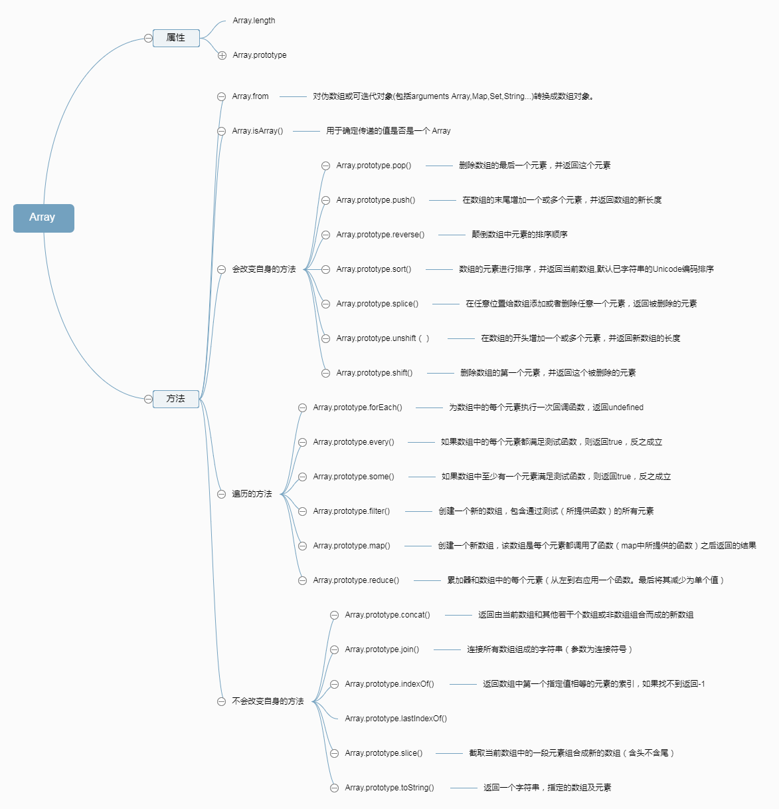
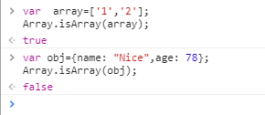
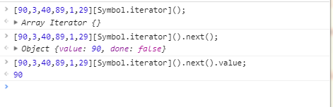

# <span style='color:rgb(230,3,135);'>Array类型</span>

在 JavaScript 中数组的每一项可以保存容纳任何类型的数据，而且数据的大小可以动态调整，我们可以声明之后就可以向其中加入值，不需要预先设定大小

创建数组的两种基本方式：
>* 1.数组字面量(常用)
```
var array=['1','2'];
```
>* 2.使用 `Array` 构造函数(不常用)
```
 var array=new Array();
```
数组最后一项的索引始终是 `length-1 `;因此新一项的位置就是 `length`；

## <span style='color:rgb(230,3,135);'>属性</span>
>  `Array.length`：`Array` 构造函数的 `length` 属性，其值为 1。
> `Array.prototype`: 允许为所有数组对象附加属性。

### 检测数组方法:Array.isArray();


### 添加元素
因为某种功能需求我们需要给已经定下的数组添加一些元素，此时我们该怎么办呐？？比如 `array=[1,2,3,4,5]`,我们需要向其中加入一些数字;
1. 简单粗暴的 `length`,一次只能添加一个**末尾**
```
array[length]=6;
```
2. 使用 `push()` 方法,一次可以添加多个到**末尾**

```
array.push(2,3)
```
3. 使用 `unshift()` 方法,一次可以添加多个到**首位**
```
array.unshift(2,3)
```
3. 使用 `splice(start​,deleteCount,item1, item2,)` 方法,在任意位置**添加**任意元素
```
array.unshift(2,0,9)
```

既然有添加元素，那肯定有对应的删除元素

### 删除元素
同理，因为某种功能需求我们需要给已经定下的数组删除一些元素，此时我们该怎么办呐？？比如 `array=[1,2,3,4,5]`,我们需要向其中删除一些数字;

2. 使用 `pop()` 方法,**删除**最后一个元素

```
array.pop()
```
3. 使用 `shift()` 方法,**删除**第一个元素
```
array.unshift()
```
3. 使用 `splice(start​,deleteCount,item1, item2,)` 方法,在任意位置**删除**任意元素
```
array.unshift(2,2,)
```
### 数组合并
既然有添加，删除，那就肯定有合并`concat`
```
var arr1=[123,4,5,6];
var arr2=[3,4,5,6,7];
var arr3=[89,0];
var arr=arr1.concat(arr2,arr3)
```
### 迭代器函数
> 用 `every()` 方法迭代

`every()` 方法会测试数组的所有元素是否都通过了指定函数的测试。
```
function isBigEnough(element, index, array) {
  return (element >= 10);
}
var passed = [12, 5, 8, 130, 44].every(isBigEnough);
// passed is false
passed = [12, 54, 18, 130, 44].every(isBigEnough);
// passed is true
```

> 用 `some` 方法迭代

`some()` 方法测试数组中的某些元素是否通过由提供的函数实现的测试。
```
const isBiggerThan10 = (element, index, array) => {
  return element > 10;
}

[2, 5, 8, 1, 4].some(isBiggerThan10);  
// false

[12, 5, 8, 1, 4].some(isBiggerThan10); 
// true
```
> 用 `forEach` 方法迭代

`forEach` 方法对数组的每个元素执行一次提供的函数。
```
const arr = ['a', 'b', 'c'];
arr.forEach(function(element) {
    console.log(element);
});

```
> 使用 `map` 返回新的数组
```
const numbers = [2, 4, 8, 10];
let halves = numbers.map(x => x / 2);
```
> 使用 `filter` 返回所有同过测试的数组
 ```
 function isBigEnough(value) {
  return value >= 10;
}
let filtered = [12, 5, 8, 130, 44].filter(isBigEnough);
 ``` 

> 使用 `reduce` 方法,数组中的每个元素（从左到右）应用一个函数,将其减少为单个值
```
var total = [0, 1, 2, 3].reduce(function(sum, value) {
  return sum + value;
}, 0);
```
## `ES6` 和数组的新功能

> 使用 `for...of` 循环迭代

 我们平时可能用 `for..in` 用的要多一点，既然他们都是循环，那么有什么区别呢？？？
 ```
 var arr=[34,56,78,34]
 for(let key in arr){
     console.log(key)
 }
//打印出来的是 key 即下标
 for(let value in arr){
     console.log(value)
 }
 //打印出来的是 value  即值
 ```
 对比我们发现，`for...in` 是循环遍历键 `key` 而 `for...of` 是循环遍历值 `value`；
> 迭代器（`@@iterator`）:`ES6`为 `Array` 类新增的 `@@iterator` 的属性，需要通过 `Symbol.iterator` 来访问
```
let iterator=array[Symbol.iterator]();//iterator为一个数组迭代器
iterator.next();//第一个迭代器对象
iterator.next().value;//第一个迭代器对象的值
```


> 数组的 `from()` 方法: 一个类似数组或可迭代对象中创建一个新的数组实例。
```
const bar = ["a", "b", "c"];
Array.from(bar);
// ["a", "b", "c"]
```
## `ES7` ---使用 `includes` 方法
如果数组里存在某个元素， includes方法会返回true，否则返回false。
```
console.log([89,09,390,12,15].includes(15));
```
附：
## 方法
### <span style='color:rgb(230,3,135);'>Mutator 方法</span>

>* 下面的这些方法会改变调用它们的对象自身的值：

> [Array.prototype.pop()](https://developer.mozilla.org/zh-CN/docs/Web/JavaScript/Reference/Global_Objects/Array/pop): 删除数组的<span style="color:red;">最后</span>一个元素，并<span style="color:red;">返回这个元素</span>。

> [Array.prototype.push()](https://developer.mozilla.org/zh-CN/docs/Web/JavaScript/Reference/Global_Objects/Array/push):在数组的末尾<span style="color:red;">增加</span>一个或多个元素，并<span style="color:red;">返回数组的新长度</span>。

> [Array.prototype.shift()](https://developer.mozilla.org/zh-CN/docs/Web/JavaScript/Reference/Global_Objects/Array/shift):删除数组的<span style="color:red;">第一个</span>元素，并<span style="color:red;">返回这个元素</span>。

> [Array.prototype.unshift()](https://developer.mozilla.org/zh-CN/docs/Web/JavaScript/Reference/Global_Objects/Array/unshift):在数组的<span style="color:red;">开头</span>增加一个或多个元素，并<span style="color:red;">返回数组的新长度</span>。

> [Array.prototype.reverse()](https://developer.mozilla.org/zh-CN/docs/Web/JavaScript/Reference/Global_Objects/Array/reverse):颠倒数组中元素的排列顺序，即原先的第一个变为最后一个，原先的最后一个变为第一个。

> [Array.prototype.sort()](https://developer.mozilla.org/zh-CN/docs/Web/JavaScript/Reference/Global_Objects/Array/sort):对数组元素进行排序，并返回当前数组。

> [Array.prototype.splice()](https://developer.mozilla.org/zh-CN/docs/Web/JavaScript/Reference/Global_Objects/Array/splice):在任意的位置给数组添加或删除任意个元素。

### <span style='color:rgb(230,3,135);'>Accessor 方法</span>

>* 下面的这些方法绝对不会改变调用它们的对象的值，只会返回一个新的数组或者返回一个其它的期望值。

>[Array.prototype.concat()](https://developer.mozilla.org/zh-CN/docs/Web/JavaScript/Reference/Global_Objects/Array/concat): 返回一个由当前数组和其它若干个数组或者若干个非数组值组合而成的新数组。

>[Array.prototype.join()](https://developer.mozilla.org/zh-CN/docs/Web/JavaScript/Reference/Global_Objects/Array/join)
: 连接所有数组元素组成一个字符串。

>[Array.prototype.slice()](https://developer.mozilla.org/zh-CN/docs/Web/JavaScript/Reference/Global_Objects/Array/slice):
抽取当前数组中的一段元素组合成一个新数组。

<i>类数组转化为数组：Array.prototype.slice.call(arguments)</i>

> [Array.from()](https://developer.mozilla.org/zh-CN/docs/Web/JavaScript/Reference/Global_Objects/Array/from) :对伪数组或可迭代对象(包括arguments Array,Map,Set,String...)转换成数组对象。

>[Array.prototype.toString()](https://developer.mozilla.org/zh-CN/docs/Web/JavaScript/Reference/Global_Objects/Array/toString):
返回一个由所有数组元素组合而成的字符串。遮蔽了原型链上的 Object.prototype.toString() 方法。

>[Array.prototype.toLocaleString()](https://developer.mozilla.org/zh-CN/docs/Web/JavaScript/Reference/Global_Objects/Array/toLocaleString):
返回一个由所有数组元素组合而成的本地化后的字符串。遮蔽了原型链上的 Object.prototype.toLocaleString() 方法。

>[Array.prototype.indexOf()](https://developer.mozilla.org/zh-CN/docs/Web/JavaScript/Reference/Global_Objects/Array/indexOf):
返回数组中第一个与指定值相等的元素的索引，如果找不到这样的元素，则返回 -1。

>[Array.prototype.lastIndexOf()](https://developer.mozilla.org/zh-CN/docs/Web/JavaScript/Reference/Global_Objects/Array/lastIndexOf):
返回数组中最后一个（从右边数第一个）与指定值相等的元素的索引，如果找不到这样的元素，则返回 -1。

### <span style='color:rgb(230,3,135);'>Iteration 方法</span>

>* 在下面的众多遍历方法中，有很多方法都需要指定一个回调函数作为参数。在回调函数执行之前，数组的长度会被缓存在某个地方，所以，如果你在回调函数中为当前数组添加了新的元素，那么那些新添加的元素是不会被遍历到的。此外，如果在回调函数中对当前数组进行了其它修改，比如改变某个元素的值或者删掉某个元素，那么随后的遍历操作可能会受到未预期的影响。总之，不要尝试在遍历过程中对原数组进行任何修改，虽然规范对这样的操作进行了详细的定义，但为了可读性和可维护性，请不要这样做。

> [Array.prototype.forEach()](https://developer.mozilla.org/zh-CN/docs/Web/JavaScript/Reference/Global_Objects/Array/forEach):
为数组中的<span style="color:red">每个元素执行一次回调函数</span>.

> [Array.prototype.every()](https://developer.mozilla.org/zh-CN/docs/Web/JavaScript/Reference/Global_Objects/Array/every):
如果数组中的<span style="color:red">每个元素都满足测试函数，则返回 true，否则返回 false。</span>

> [Array.prototype.some()](https://developer.mozilla.org/zh-CN/docs/Web/JavaScript/Reference/Global_Objects/Array/some):
如果数组中<span style="color:red">至少有一个元素满足测试函数，则返回 true，否则返回 false。</span>

> [Array.prototype.filter()](https://developer.mozilla.org/zh-CN/docs/Web/JavaScript/Reference/Global_Objects/Array/filter):
将所有在<span style="color:red">过滤函数中返回 true 的数组元素放进一个新数组中并返回。</span>

> [Array.prototype.map()](https://developer.mozilla.org/zh-CN/docs/Web/JavaScript/Reference/Global_Objects/Array/map):
返回一个由<span style="color:red">回调函数的返回值组成的新数组</span>。

> [Array.prototype.reduce()](https://developer.mozilla.org/zh-CN/docs/Web/JavaScript/Reference/Global_Objects/Array/reduce):
<span style="color:red">从左到右</span>为每个数组元素执行一次回调函数，并把上次回调函数的返回值放在一个暂存器中传给下次回调函数，并返回最后一次回调函数的返回值。

> [Array.prototype.reduceRight()](https://developer.mozilla.org/zh-CN/docs/Web/JavaScript/Reference/Global_Objects/Array/reduceRight):
<span style="color:red">从右到左</span>为每个数组元素执行一次回调函数，并把上次回调函数的返回值放在一个暂存器中传给下次回调函数，并返回最后一次回调函数的返回值。
