# 浅论数据结构，算法在大前端领域的应用

以前我总是不能理解为什么大部分的校招笔试都是考**数据结构**和**算法**，因为我不了解数据结构，也不懂算法。我就完美的错过了去年的秋招。就在那时我还不明白数据结构和前端到底是什么关系。无意间我听到有人说编程**核心和灵魂是算法和数据结构**，选择何种语言去实现只是一种工具。听了之后我有点不开心啦，这么久了我居然只会用一个工具。为了探究其原因我买了《大话数据结构》和《啊哈算法》。这两本书居然只有 `java` 和 `C` 语言版。很刺激，很有挑战性，一个勉强只看得懂 `JavaScript` 的要去看 `C` 语言写的东西。

仔细想想，我作为一个 18 届的毕业，已经错过了大型的秋招，就不应该在错过春招。昨晚上我又把这个同样的问题抛出来，有位朋友简单的告诉数据结构很重要，是其他学科的基础。完了他还告诉我，我们作为非科班的程序员，需要付出很多努力来夯实基础。那非科班的程序员我们就一起努力，加油吧

为了寻找更加明确的答案，我再一次死磕数据结构，算法。我想说：我终于知道的数据结构，算法在我大前端领域的应用。那我就作为一个初学者，来说说吧，如果有问题希望能够指出来，谢谢！
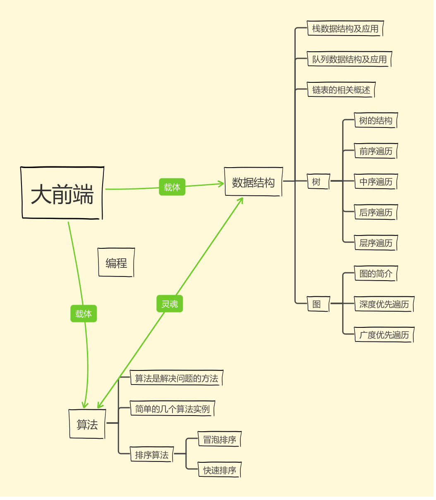
## 算法
算法是描述解决问题的方法；既然是方法，那自然就会有优劣之分；算法是运行在程序中的，对程序而言，运行速度快，存储空间少，效率高就是好算法；反之也成立；

1. 如果让你求一个1+2+3+4+...+100的结果程序，你会怎么写呢？

    看到问题，我脑海里立马就想到了循环，于是乎答案就出来啦~
```
var sum=0,n=101
for(var i=1;i<n;i++){
    sum+=n;
}
```
细细分析，在程序中 `n` 每增加一个，程序就会循环运行一次，运行的时间会随着 `n` 的增加而不断增加。是能解决问题，但是效率不高，那还有没有比这个更好的方法呢？

突然回想起，当年我上小学的时候老师也经常出这样的题目，那时候的解决方法好像简单许多
```
var sum=0，n=100；
sum=(1+n)*n/2;
```
简单分析分析，在这个程序中，无论 `n` 是多少，程序始终只运行一次。和前面的方法相比，我想我不用说你就能明白啦！再来看几个例子

2. 想必大家都知道[斐波那契数列](https://baike.baidu.com/item/%E6%96%90%E6%B3%A2%E9%82%A3%E5%A5%91%E6%95%B0)，现在要求输入一个整数 `n`，请你输出斐波那契数列的第 `n` 项？

    我用迭代实现
```
function Fibonacci(n){
    if(n>1){
        var fn0=0,fn1=1,fn2=0;
        for(var i=0;i<n;i++){
            fn2=fn1+fn0;
            fn0=fn1;
            fn1=fn2;
        }
        return fn2;
    }
    return n;
}
```
    我用数组和迭代实现
```
function Fibonacci(n){
    var arr=[];
    arr[0]=1,arr[1]=1;
    for(var i=2;i<n;i++){
        arr[i]=arr[i-1]+arr[i-2];
    }
    return arr[i-1];
}
```
我还能用递归实现
```
function Fibonacci(n){
    if(n<2) return n==0 ? 0:1;
    return Fibonacci(n-1)+Fibonacci(n-2)
}
```
我来分析分析上面的几种方法，迭代使用的是循环结构，递归使用的选择结构；

乍一看，好像递归是三种里面最好的选择；不但使程序的结构更加清晰，更简洁，更容易让人理解，减少**读懂代码的时间**；但是别忽略啦！！！当 `n` 数量特别大时，递归调用会建立函数的副本，会耗费大量的时间和内存。反观迭代，虽然代码量多，但是不会去反复调用函数和产生额外的内存；不信，你去试试

哈哈哈哈，这就是算法。判断一个算法的优劣，不是只通过少量的数据，就能做出准确判断，因此根据需求情况选择不同的代码实现方式；

在算法中**正向思维，逆向思维，整合思维**，混在一起可以创造巨大的价值

我们上面提到到过**递归**，那么递归是什么？？？他是如何实现呢？？底层原理是什么？？答案在文中会出现的，需要慢慢去看，去摸索

### 排序算法
> 1.`JavaScript` 实现一组数从小到大排序?

>* 冒泡排序：比较两个相邻的元素，如果他们的顺序错误，就把他们交换过来；
```
function bubbleSort(arr){
    var len=arr.length;
    for(var i=0;i<len;i++){
        for(var j=0;j<len-1;j++){
            if(arr[j]>arr[j+1]{
                //两个数交换顺序
                arr[j]+=arr[j+1];
                arr[j+1]=arr[j]-arr[j+1];
                arr[j]-=arr[j]
            })
        }
    }
}
```
我们发现冒泡排序利用的是双重嵌套循环，时间复杂度是 `O(N^2)`;这个函数能解决问题，得到我们想要的答案，很显然这并不是一个好的算法；确实，我只是借这个来说明什么是冒泡排序，哈哈

如果不是考虑到要介绍冒泡排序，我会选用数组的 `API` 去实现
```
array.sort(function(a,b){return a-b});
```
> 2.在一个二维数组中，每一行都按照从左到右递增的顺序排序，每一列都按照从上到下递增的顺序排序。请完成一个函数，输入这样的一个二维数组和一个整数，判断数组中是否含有该整数?

仔细分析的话，不难发现这是一个从小到大已经排好序的数组，我们需要做的是在去这个数组中找一个数字！

既然我的大标题是排序算法，那我就是想要利用排序的原理来解决这个问题

>* 快速排序：冒泡排序的升级版，他是尽可能的少的移动交换的次数来实现查找，利用**二分法的思想**
```
function Find(target, array)
{
let i=0;
let j=array[i].length-1;
    while(i<array.length&&j>=0){
        if(array[i][j]>target){
            j--;
        }else if(array[i][j]<target){
            i++;
        }else{
            return true;
        }
    }
    
}
```
我们不确定什么时候找到这个数字，所以用了 `while` 循环。在不确定循环次数的时候，用 `while`  循环。不知道你会不会一说到循环就想到 `for` ; 其实每一个语句，都有他存在原因，我们不应该因为能实现就滥用；`for...in`,`for...of`,`forEach()`,`map()`，都可用于循环。具体用哪个我们要根据情况而定；

## `JavaScript` 的数据结构
在ECMAScript中，引用类型是一种数据结构，用于将数据和功能组织在一起；数组是某个引用类型的实例，我们以数组为例，如果你想详细了解数组相关知识请参考 [`Array`](https://github.com/sunseekers/Article-CSS-HTML-JavaScript-/blob/master/Array.md)

我们知道可以在数组中任意位置上删除或者添加元素，有时候我们需要一种在添加或删除元素时能够有更多控制的数据结构。有两种数据结构类似于数组，但在添加和删除元素时更为可控。它们就是栈和队列。
## 栈
### 栈数据结构
栈是一种后进先出(`LIFO`),就好比在我当年上学的时候经常会上交作业给老师批改，一般老师批改作业都是从上往下批阅我们的作用，而我们最先交的作业却是压在最下面的。这其实是一种栈结构，后进先出，没想到吧，在我们的生活中随处可以

在我们的 `JavaScript` 数组也有用到栈结构，只是人家已经替我们写好了相关的 `API` ，我们只需要直接调用就可以了，`push()` 和 `pop()`; 数据结构和我们的 `JavaScript` 还是有点关系的。

### 栈的应用---递归

递归是一个前行和回退的顺序，比如我们前面说的那个输出斐波那契数列的第n项
```
function Fibonacci(n){
    if(n<2) return n==0 ? 0:1;
    return Fibonacci(n-1)+Fibonacci(n-2)
}
```
假设`n`=5
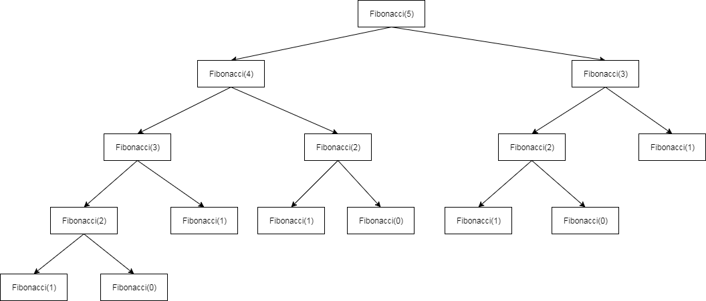
很明显我们可以看出，递归不断的从 `Fibonacci(5)` 不断回退，一直回退到 `n` 不能在减少，回退的过程相当于压入栈；而要得到计算的结果，需要把栈内的数据一个一个拿出来计算（即前行）相当于出栈；

## 队列
### 队列的数据结构
队列和栈长得差不多，但是队列似乎更加同情讲理，秉承公平公正的原则，**先进先出**，就和我日常生活排队打饭一样，排在前面的先吃饭；
在我们的 `JavaScript` 数组中，也有队列结构，只是前辈们已经替我们实现了，我们只需要调用即可`unshift()`和`shift()`;
### 队的应用---`JavaScript` 任务队列
我们知道在 `JavaScript` 是单线程程序处理所有的任务；在处理用户交互的时候，会按照严格的先后顺序，否则整个页面混乱不堪；对于事件处理程序，浏览器总是会严格的按照先后顺序来实现；即队列结构
## 链表
### 链表的相关概述简介
链表的存储结构
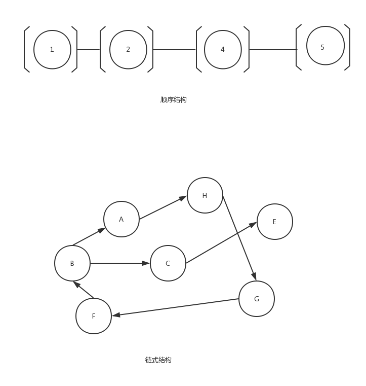
链表的相关介绍
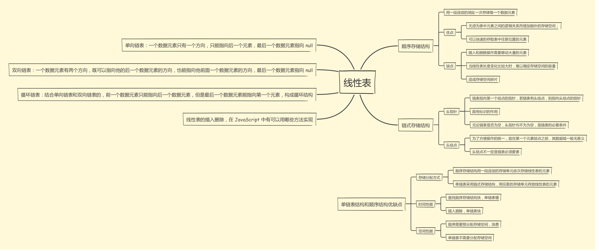

### 链表的操作
1. 向链表中追加元素

数组中可用 `push()` , `unshift()` , `splice()` 方法，原生 `javascript DOM` 插入节点可用 `appendChild()`，添加事件 `addEventListener()`....

2. 向链表中移除元素

数组中可用 `pop()` , `shift()` , `splice()` 方法，原生 `javascript DOM` 插入节点可用 `removeChild()`, 移除事件 `addEventListener()`....

咦，原来数据结构的链表操作在前端领域也有用到，只是我们平时没有注意到而已；是不是所有的和前端领域相关数据结构都已经有人替我实现了呢？并没有。我只想说：“那有什么岁月静好，只是有人再替你负重前行罢了”！
## 树
在我们大前端领域，耳详能熟的 `DOM` 就是一个层次化节点的树，我们发开人员经常会对 `DOM` 树进行添加，修改移除操作；原来树结构离我们这么近！
### 树的结构
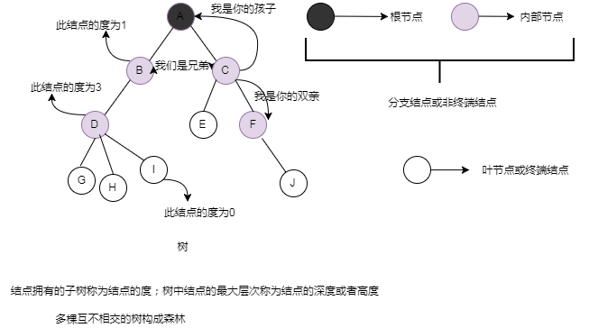
度为0的结点称为叶节点或终端结点；

度不为零的结点称为非终端结点或分支结点。

除了根节点之外，分支结点也称为内部节点；

树的度是树内各结点的度的最大值；

树中结点的最大层次称为树的深度或高度
###  `JavaScript` 的树数据结构应用
前面我介绍过数据结构的栈，队，还有列表，我们都可以直接使用`JavaScript` 中现有的 `API` 去实现了，我们自己只要直接去调用就好了，无需去关心低层；我们自己都还没有动手去尝试 `JavaScript` 的数据结构

那我们就动手来实现一个吧！看完以后你会发现，原来这么简单！(至少比我去死磕 `C` 语言的简单多啦！)。我们以二叉搜索树为例


二叉搜索树(`BST`) , 是二叉树的一种，他有一个最明显的特点就是左侧节点存储值永远比父节点小，右侧节点存储值永远比父节点大；

```
//创建一棵二叉搜索树
    function BinarySearchTree(){
      //声明一个节点，表示树中的每一个节点
      var Node=function(key){
        this.key=key;
        this.left=null;
        this.right=null;
      };
      //声明 root 为根节点
      var root=null;
      //向树中插入一个节点
      this.insert=function(key){
        var newNode=new Node(key);//创建一个新的节点
        if(root===null){//插入的节点是否是根节点
          root=newNode;
        }else{
          insertNode(root,newNode);//将节点插入到非根节点的位子
        }
      };
      this.insertNode=function(node,newNode){
        if(newNode.key<node.key){//新节点是否小于当前节点
          if(node.left===null){//左节点为空
            node.left=newNode;//新节点赋值给左节点
          }else{
            insertNode(node.left,newNode);//继续找树的下一层节点
          }
        }else{
          //和上面的一样，只是左换成右
          if(node.right===null){
            node.right=newNode;
          }else{
            insertNode(node.right.newNode);
          }
        }
      }
    }
```
这段代码就是由**算法, 数据结构和 `JavaScript`**实现 ; 算法负责描述解决问题的步骤，`JavaScript` 作为一种语言工具载体，结合数据结构中最重要的树结构；`C` 语言也能实现，`Java` 也能实现，只是我不会而已啦。这已经足够说明了**语言**只是一种工具;算法和数据结构在编程中的核心灵魂由此体现；

### 树的遍历
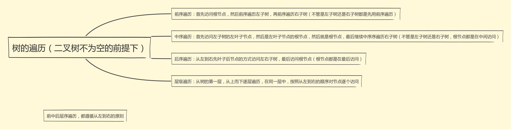

> 前序遍历
```
this.preOrderTraverse=function(callback){
    preOrderTraverseNode(root,callback)
}
var preOrderTraverseNode=function(node,callback){
    if(node!=nill){
        callback(node.key);//先访问节点本身
        preOrderTraverseNode(node.left,callback);//再左侧节点
        preOrderTraverseNode(node.right,callback);//最后右侧节点
    }
}
```
> 中序遍历
```
this.preOrderTraverse=function(callback){
    preOrderTraverseNode(root,callback)
}
var preOrderTraverseNode=function(node,callback){
    if(node!=nill){
        preOrderTraverseNode(node.left,callback);//先访问左侧节点
        callback(node.key);//再节点本身
        preOrderTraverseNode(node.right,callback);//最后右侧节点
    }
}
```
> 后序遍历
```
this.preOrderTraverse=function(callback){
    preOrderTraverseNode(root,callback)
}
var preOrderTraverseNode=function(node,callback){
    if(node!=nill){
        preOrderTraverseNode(node.left,callback);//先访问左侧节点
        preOrderTraverseNode(node.right,callback);//再右侧节点
        callback(node.key);//最后访问节点本身
    }
}
```
> 层序遍历
```
this.preOrderTraverse=function(callback){
    preOrderTraverseNode(root,callback)
}
var preOrderTraverseNode=function(node,callback){
    if(node!=nill){
        preOrderTraverseNode(node.left,callback);//先访问左侧节点
        preOrderTraverseNode(node.right,callback);//再右侧节点
    }
}
```
## 图
图就是顶点和边的集合，通常表示为G(V,E),其中G表示一个图，V是图G中顶点的集合，E是图G中边的集合；

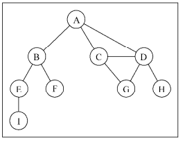

### 图的各种定义
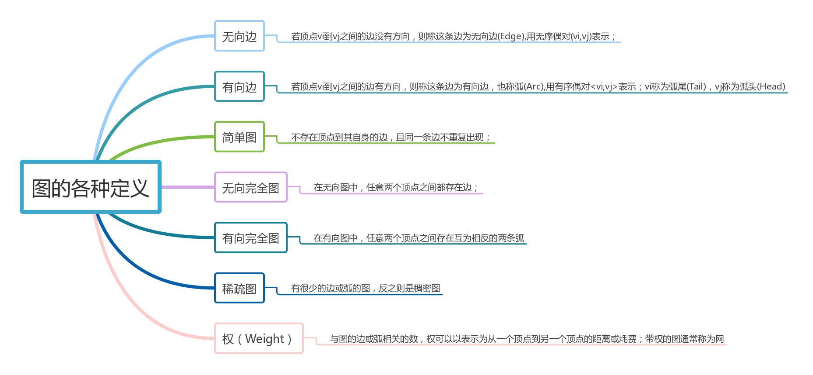

### 图，树，线性表之间区别
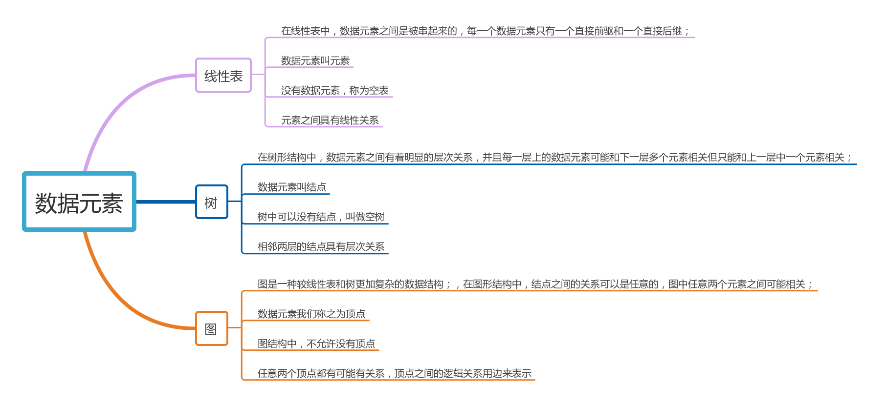

### 图的存储结构
图上任何一个顶点都可以被看做成一个顶点，任一顶点的邻接点之间不不存在先后次序关系；
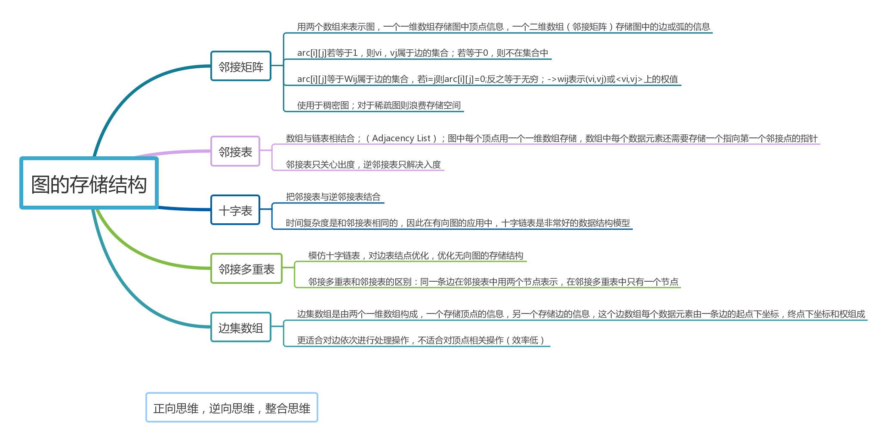

> 邻接矩阵:把所有的顶点作为二维数组的属性，顶点之间的关系作为二维数组的值;arr[i][j]===1,表示节点相邻
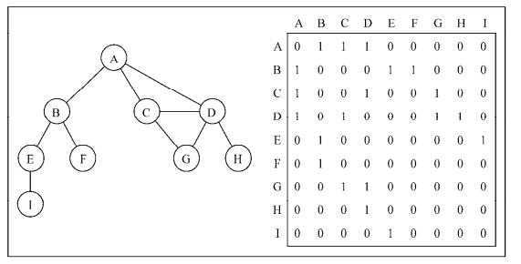

> 邻接表:把所有相邻的节点，写成链表形式,一眼就能看出哪些节点相邻
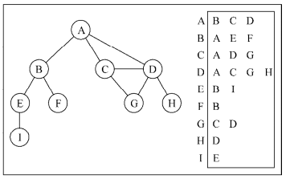

### 创建 Graph 类
```
function Graph(){
    var vertices=[];//存储所有顶点的名字
    var adjList=new Dictionary();//存储邻接表
    //想图中添加新的顶点
    this.addVertex=function(v){
        vertices.push(v);
        adjList.set(v,[]);//设置邻接列表
    };
    this.addEdge=function(v,w){
        //v加入w，w加入v，变成无向图
        adjList.get(v).push(w);
        adjList.get(w).push(v);
    }
}
```
### 图的遍历
图遍历算法的思想从图某一个顶点出发，遍历图中其余的顶点。需要明确指出第一个被访问的顶点。每个顶点至多两次。


> 广度优先搜索（Breadth-First Search， BFS）：广度优先搜索就是一层一层的往下;和我们的层序遍历真的差不多

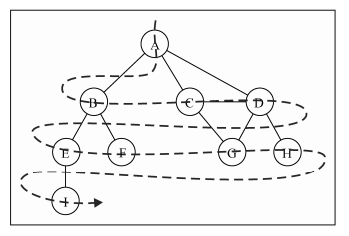

我们用白色：表示该顶点还没有被访问
灰色：表示该顶点被访问过，但并未被探究过
黑色: 表示该顶点被访问且被完全探索过
```
var initializeColor=function(){
    var color=[];
    for(var i=0;i<vertices.length;i++){
        color[vertices[i]]='white';//vertices表示顶点的个数，未访问之前都是白色
    }
    return color;
}
var bfs=function(v,callback){
        var color=initializeColor(),
            queue=new Queue(),//存储带访问和待探索的顶点
            queue.enqueue(v);//图遍历的起始节点
            while(!queue.isEmpty()){//如果队列是非空
                var u=queue.dequeue();//把这个顶点移出去
                neighbors=adjList.get(u);//获取他的所有邻接表，
                color[u]='grey';//标记为访问过的顶点
                for(var i=0;i<neighbors.length;i++){
                    var w=neighbors[i]
                    if(color[w]==='white'){
                        color[w]='grey';
                        queue.enqueue(w);
                    }
                }
                color[u]='black';//探索该顶点和相邻的顶点之后，我们将它标记为以探索过的
                if(callback){
                    callback(u);
                }
            }

    }
```
这就是用 `JavaScript` 语言工具实现的
> 广度优先搜索的应用———寻找最短路径(和上面相同的代码就不在注释)
```
this.BFS=function(v){
    var color=initializeColor(),
        queue=new Queue(),
        d=[],//表示距离
        pred=[];//表示前一个点
        queue.enqueue(v);
        for(var i=0;i<vertices.length;i++){
            d[vertices[i]]=0;//初始化数组
            pred[vertices[i]]=null;//初始化数组
        }
        while(!queue.isEmpty()){
            var u=queue.dequeue(),
            neighbors=adjList.get(u);
            color[u]='grey';
            for(var i=0;i<neighbors.length;i++){
                var w=neighbors[i];
                if(color[w]==='white'){
                    color[w]='grey';
                    d[w]=d[u]+1;//设置u和w之间的距离
                    pred[w]=u;//u是w的前一个点
                }
            }
            color[u]='black';
        }
        return {//返回距离和点
            distances:d,
            predecessors:pred
        }
}
```
通过仔细对比发现，寻找最短路径和广度优先搜索，只多了两个变量，那两个变量分别用来记录路径和点；居然就能实现找到最短路径。很神奇，也很厉害；

> 深度优先搜索（Depth-First Search， DFS）:深度优先搜索形象比喻成翻个底朝天，和我们前面说的前序遍历长得差不多；`DOM` 树的遍历采用的是深度优先遍历

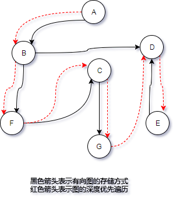

用我熟悉的 `JavaScript` 语言作为工具实现

```
this.dfs=function(callback){
    var color=initializeColor();
    for(var i=0;i<vertices.length;i++){
        if(color[vertices[i]]==='white'){
            dfsVisit(vertices[i],color,callback);
        }
    }
};
var dfsVisit=function(u,color,callback){
    color[u]='grey';
    if(callback){
        callback(u);
    }
    var neighbors=adjList.get(u);
    for(var i=0;i<neighbors.length;i++){
        var w=neighbors[i];
        if(color[w]==='white'){
            dfsVisit(w,color,callback);
        }
    }
    color[u]='black';
}
```
## 数据结构，算法在前端领域的应用
我只是简单的介绍了一下算法是什么，数据结构大概有哪些内容，都不是特别全，也没有很细很细的去讲解她们的概念用法。说了那么多，我只是想要去表达她们在前端领域的应用；在前端领域随处可见的是她们的身影，我所知道的只是冰山一角。我的大前端还等着我去一步一步去探索


