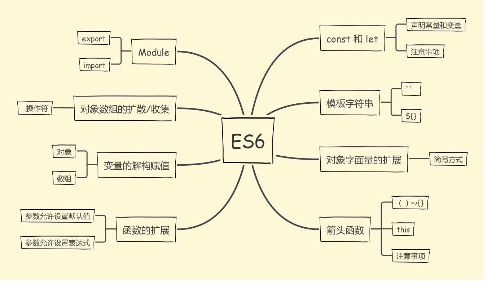
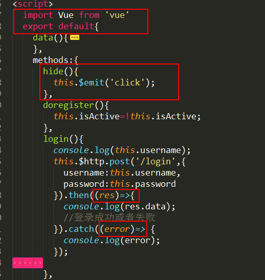

# `ES6` 语法大全上


最近在做毕业设计，其中用到了一些 ES6 的语法，比如模块的输出引入，箭头函数，对象字面量的简写，等等。所性顺便就学一下 ES6 的语法，做一个笔记总结。

## `let` 和 `const` 命令
在 `JavaScript` 中变量作用域的基本单位总是 `function`。如果你需要创建一个块级作用域，除了普通的函数声明以外最流行的方法就是使用立即被调用的函数表达式（IIFE）。
```
var a = 2;
(function IIFE(){
	var a = 3;
	console.log( a );	// 3,a=3,只存在函数内部
})();
console.log( a );		// 2
```
在 `ES6` 中实现了块级作用域，不需要我们再去借用函数来实现块级作用域了。

<b>为了更加语义化，我们习惯用 {} 包裹 `let` 和 `const` 命令，用来表示块级作用域的范围</b>

声明变量用 `let` ，声明常量用 `const`；`const` 用于那些你有意地并且明显地标识为不会改变的变量，具体使用什么应该视情况而定

`let` 命令
```
var a = 2;
{
  let a = 3;
  console.log( a );	// 3
}
console.log( a );		// 2
```
>* 不存在变量提升，变量一定要在声明后使用，否则会报错，存在暂时性死区
>* 块级作用域，(使得广泛应用的立即执行函数（IIFE)不在必要了
>* `let` 不允许在相同的作用域内重复声明一个变量

`const` 命令

声明一个常量，一旦定义不允许修改
```
{
  const a = 2;
  console.log( a );	// 2
  a = 3;				// TypeError!,一旦在声明时被设定就不允许你改变了
}
```
注意：`const` 声明的值不会因为 `const` 而冻结或不可变，只是它的赋值被冻结了。如果这个值是一个复杂值，比如对象或数组，那么这个值的内容仍然是可以被修改的（变量 `a` 实际上没有持有一个固定的数组；而是指向数组的恒定的引用。（引用类型赋值）数组本身可以自由变化。）：
```
{
  const a = [1,2,3];
  a.push( 4 );
  console.log( a );		// [1,2,3,4]
  a = 42;					// TypeError! 
}
```

>* `const` 一旦声明常量，就必须立即初始化，不能留到以后赋值,在声明时被设定就不允许你改变了
>* 只在声明所在的块级作用域内有效，不能重复声明常量
>* 声明的常量不提升，存在暂时性死区，只能在声明之后使用
>* `const` 不允许在相同的作用域内重复声明一个变量

## 对象数组的扩散/收集
`ES6` 引入了一个新的 `...` 操作符，它一般被称作 扩散（spread） 或 剩余（rest） 操作符
```
function foo(x,y,z) {
  console.log( x, y, z );
}
foo( ...[1,2,3] );  //1 2 3 将...[1,2,3] 扩散成 x=1,y=2,z=3

var a = [2,3,4];
var b = [ 1, ...a, 5 ];
console.log( b ); //[1, 2, 3, 4, 5],相当于[1].concat( a, [5] )
```
`...` 可把她们扩散，同样也可以把她们收集起来
```
function foo(...args) {
  console.log( args );
}
foo( 1, 2, 3, 4, 5); // [1,2,3,4,5],将1，2，3，4，5收集到...args里面。是一个参数数组
```
## 模板字符串
模板字符串是增强版的字符串，用反引号 ` 标识，他可以当做普通字符串使用，也可以用来定义多行字符串，或者在字符串中嵌入变量；

<i>使用反引号 `` 将整个字符串包裹起来，`${}` 包裹一个变量或者表达式，如果变量没有声明，则报错，大括号中的值不是字符串，将按照一定的规则转化为字符串</i>

如果在字符串中需要使用反引号，则需要在其前面用反斜杠转义(如 \ `)；

静态字符串一律使用单引号或反引号，不使用双引号，动态字符串使用反引号
```
function upper(s) {
	return s.toUpperCase();
}
let who = "reader";
let text =
`A very ${upper( "warm" )} welcome to all of you ${upper( `${who}s` )}!`;
console.log( text );
// A very WARM welcome to all of you READERS!
```
## 变量的解构赋值
从一个数组中取得索引的值，或从一个对象中取得属性并手动赋值可以被认为是 结构化赋值，比如
```
function foo() {
  return [1,2,3];
}
let tmp = foo(),
	a = tmp[0], b = tmp[1], c = tmp[2];
console.log( a, b, c );				// 1 2 3
```
如果剔除中间变量 `tmp` 而直接进行赋值称为解构赋值
```
function foo() {
  return [1,2,3];
}
let [a,b,c]=foo();
console.log(a,b,c); // 1 2 3
```
从数组和对象中提取值，对变量进行赋值，被称为解构，本质上属于“ 模式匹配 ”，只要等号两边的模式相同，左边的变量就会被赋予对应的值

数组解构：
> 如果右边的少于左边的参数，视为解构不成功，变量值就等于 `undefined`
```
let [a,b,c,d]=['a'];
console.log(a,b,c,d);  //a undefined undefined undefined
```
> 如果右边的多余于左边的参数，视为不完全解构，多余的值将会被忽略
```
let [a,b,c,d]=[1,2,3,4,5,6];
console.log(a,b,c,d);  //1 2 3 4
```
对象解构：
对象解构与数组解构有一个重要的不同，数组的元素是按照次序排列的，对象的属性没有次序，变量必须与属性同名才能取到正确的值
```
let {bar,foo}={foo:'111',bar:'222'}
console.log(bar,foo);  //222 111
```
注意：上面我们使用了对象属性赋值的简写，即如果属性名与你想要声明的变量名一致，我们可以使用简写，上面例子等同于
```
let {bar：bar,foo:bar}={foo:'111',bar:'222'}
console.log(bar,foo);  //222 111
```
## 函数的扩展
`ES6` 允许为函数的参数设置默认值，即直接写在参数定义后面

```
function log(x,y='world'){
  console.log(x,y);
}
log('Hello');  //Hello world
```
参数变量是默认声明的，所以不能使用 `let` 和 `const` 再次声明 ( 因为 `let` 和 `const` 不能重复声明变量 )

通常情况下，定义了默认值的参数应该是函数的尾参数，因为这样比较容易看出，到底是省略了哪些参数，如果非尾部的参数设置默认值，实际上这个参数是无法省略的

`ES6` 允许为函数的参数设置默认值表达式，即直接把参数写成表达式
```
function bar(val) {
  console.log( "bar called!" );
  return y + val;
}
function foo(x = y + 3, z = bar( x )) {
  console.log( x, z );
}
let y = 5;
foo();	// "bar called"									// 8 13
foo( 10 );	// "bar called"									// 10 15
```
注意：
```
let w = 1, z = 2;
function foo( x = w + 1, y = x + 1, z = z + 1 ) {
  console.log( x, y, z );
}
foo();  // ReferenceError,因为在参数里面声明了（他就没向上寻找外部的作用域），而参数里面没有初始化，所以直接使用会报错
```
## 对象字面量扩展
一般情况的对象字面量声明
```
let x=2,y=9,
   o={
       x:x,
       y:y
   },
   p={
       foo:function(){},
       bar:function(){}
   }
```
因为对象的属性名和变量名一致，在 `ES6` 中我们可以使用简写(省略:x，:y,:function)：
```
let x=2,y=9,
   o={
       x,
       y
   },
   p={
       foo(){},
       bar(){}
   }
```

注意：我们应当仅在永远不需要将它们用于递归或事件绑定/解除时使用它们；否则会出现丢失函数的问题；

计算型属性名

`ES6` 为对象字面定义增加了一种语法，它允许你指定一个应当被计算的表达式，其结果就是被赋值属性名。
```
let user='user_',
    o={
        [user+'foo']:function(){},
        [user+'bar']:function(){},
    };
console.log(o);  //Object {user_foo: function, user_bar: function}
```
## 箭头函数

箭头函数可以替换函数表达式，但是不能替换函数声明；它们都是匿名函数表达式 —— 它们没有可以用于递归或者事件绑定/解除的命名引用

如果箭头函数的代码部分多余一条语句，就要用大括号将其括起来，并使用 `return` 语句返回；
```
let foo = (x,y) => x + y;
let f3 = (x,y) => {
	let z = x * 2 + y;
	y++;
	x *= 3;
	return (x + y + z) / 2;
};
```
由于大括号被解析为代码块，所以如果箭头函数直接返回一个对象，必须在对象外面加上括号


箭头函数有几个使用注意点

1. 函数体内的 `this` 对象就是定义时所在的对象，而不是使用时所在的对象；<b> `this` 对象的指向是固定的</b>

2. 不可以当做构造函数，即不能使用 `new` 命令，否则会抛出一个错误;因为箭头函数没有自己的 `this` ，导致内部的 `this` 就是外层代码块的 `this` ，所有没有构造函数；

3. 不可使用 `arguments` 对象，该对象在函数体内不存在，如果要用，可以用 `rest` 参数替代


4. 由于箭头函数没有自己的 `this` ，所以不能用 `call(),apply(),bind()` 这些方法去改变 `this` 的值；

5. 在 `ES6` 中，默认会用严格模式，因此 `this` 不会自动指向 `window` 对象，而箭头函数本身没有 `this` ，因此 `this` 就只能是 `undefined` ；

6. 简单的，单行的，不会复用的函数，建议采用箭头函数，如果函数体较为复杂，行数比较多，还是应该使用传统的函数写法
## 尾调用优化

函数调用会形成一个"调用记录"，又称"调用帧"，如果函数在函数 A 的内部调用函数 B ，那么在 A 的调用帧上方形成一个 B 的调用帧，等到 B 运行结束，将结果返回 A ，B 的调用帧才会结束；

尾调用由于是函数的最后一步，不需要保留外层函数的调用帧，因为调用位置，内部变量等信息都不会再用，直接内层函数的调用帧取代外层函数即可；可以节省内存 

## Module
模块功能主要由两个命令构成 `import` 和 `export` ，并且他们都必须总是出现在它们分别被使用之处的顶层作用域。`export` 命令用于规定模块的对外接口， `import` 命令用于输入其他模块提供的功能;在模块中没有全局作用域。

1. `export` 命令
一个模块就是一个独立的文件，该文件内部的所有变量，外部无法获取，如果希望外部能够读取，模块内部的某个变量，就必须使用 `export` 关键字输出该变量
```
export function foo() {
	// ..
}
```

2. `import` 命令
使用 `export` 命令定义了模块的对外接口以后，其他 `js` 文件可以通过 `import` 命令加载这个模块文件

```
import foo form './foo';

```
表示加载 `foo.js` 文件，`import` 命令接受一个对象（用大括号表示），里面指定要从其他模块导入的变量名；大括号中变量名必须与被导入的模块（`foo.js`）对外接口的名称相同

`import` 命令具有提升效果，会提升到整个模块的头部首先执行；

如果在一个模块中先后输入后输出同一个模块，`import` 和 `export` 语句写在一起，不建议那样写；

`module` 命令可以取代 `import` 语句，达到整体输入模块的作用；

module 命令后面跟一个变量，表示输入的模块定义在该变量上

`export default` 命令为模块指定默认输出，其他模块在加载该模块时， 默认输出是一个函数， `import` 命令可以为该匿名函数指定任意名字；`import` 命令后面不使用大括号；

`export default` 命令只用于指定模块的默认输出，显然一个模块只能有一个默认输出，因此 `export default` 命令只能使用一次，所以 `import` 命令后面才不加大括号，因为只可能对于一个方法

暂时就先介绍到这里；等毕设差不多做完的时候，就准备着手找工作。
