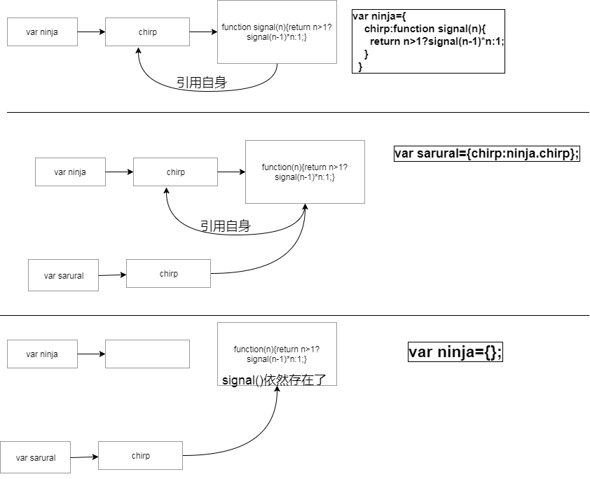

 <h1 style='color:rgb(230,3,135);' >函数</h1>
 
 
 [查看原图](http://naotu.baidu.com/file/1503f2d147f4c34f9fe03981e92c3703?token=a756e94dc83a5c30)

在 JavaScript 中函数是第一类型的对象(函数是对象)，我们可以将函数视为任何类型的 JavaScript 对象；函数是代码执行的主要模块化单元，我们大部分代码执行运行都是函数调用的结果

> 1. 函数可以拥有有属性

```Function.prototype 或者 Function.arguments...```

 利用函数具有属性可以被存储任何信息，我们可以利用这个特性来做很多事情；例如：
  
  ```
  //储存函数,利用函数具有属性，而且这些属性能够被存储任何信息
  let store = {
    nextId:1,
    cache:{},
    add(fn){
      if(!fn.id && typeof fn =='function'){
        fn.id=this.nextId++
        this.cache[fn.id]=fn
        return true
      }
    }
  }
  //记忆函数
  function isPrime(value){
    if(!isPrime.answers){
      isPrime.answers = {}
    }
    if(!isPrime.answers[value]){
      console.log(1)
      return isPrime.answers[value] = value
    }
    console.log(3)
    return isPrime.answers[value]
  }
  isPrime(2)
```

> 2. 函数可以拥有方法

```Function.prototype.apply() , Function.prototype.call()Function.prototype.bind()...```

> 3. 函数可以赋值给变量，数组或者其他对象属性给变量 

```
var large=function (){}
var obj={
  large:function(){}
}
```
> 4. 函数还能被调用 
```
function large(){},large();
```
> 5. 当然函数还享有普通对象所拥有的特性，因为 `Function` 继承 `Object`

> 6. 函数可以作为参数传递给函数，（函数名本身是变量，所以函数也可以作为值来使用；即可以把函数作为参数传递给另一个函数，也可以把函数作为另一函数的结果返回；）

```
function add(a,b){
    return a+b
}
function sum(fn,c){
    return fn+c
}
sum(add(2,3),4);//9
```

我们在给函数传参数的时候，除了有我们显示传入的实参之外，其实还包含了两个隐士参数 `this` 和 `arguments`。`this` 表示被调用函数的上下文(在什么环境下调用，就指向什么）。`arguments` 表示函数调用过程中传递的所有参数

`arguments` 是伪数组，在 `es6` 中有一个剩余参数的概念，剩余参数是一个真正的数组

> 7. 函数可以作为返回值进行返回

```
function add(a,b){
    return a+b;
}
add(2,3)//5
```
所以说函数是**第一类型对象**，函数是代码执行的主要**模块单元化**

*函数包含一组语句，用来指定对象的某一种行为，是JavaScript的基础模块单元，用于代码复用，信息隐藏和组合调用；*

所谓的编程，**就是将一组需求分解成一组函数与数据结构的技能**

函数名是指向函数对象的指针。如果没有函数名，我们就称之为匿名函数，匿名函数没有指向函数对象的指针，一般情况下我们会立即执行函数，或者将匿名函数赋值给变量；

函数创建的两种方式：函数声明和函数表达式(匿名函数，拉姆达函数)


`JavaScript` 解析器必须能够轻易区分函数声明和函数表达式之间的区别。如果去掉包裹函数表达式的括号，把立即调用作为一个独立语句 `function() {}(3)`，`JavaScript` 开始解析时便会结束，因为这个独立语句以 `function` 开头，那么解析器就会认为它在处理一个函数声明。每个函数声明必须有一个名字（然而这里并没有指定名字），所以程序执行到这里会报错


其中`num1` 和 `num2` 是函数的形参，（形参，形式上的参数）当 `num1`和`num2`作为具体的数据传递给函数时，就是实参，（实参，实际的参数）
**形参和实参**
> 如果形参个数大于实参个数，剩下没有对应的形参将赋值为 `undefined`

> 如果形参个数小于实参个数，多余的实参将会自动忽略

<b>函数声明和函数表达式的区别：</b>

我们可以将表达式视为一个匿名函数，然后将其赋值给变量
> 1. 解析器会率先读取函数声明，并在执行任何代码之前可以访问；函数表达式必须等到解析器执行到他所造的代码才会真正被解析<b>（函数声明会提前；函数表达式不会）</b>;
> 2. 函数声明后面不能跟圆括号；表达式可以（表达式后加圆括号表示函数调用）；
> 3. 函数声明只能创建局部函数；函数表达式可创建全局函数

在函数体内，变量声明的作用域开始于声明的地方，结束于所在函数的结尾，与代码嵌套无关；(即函数的作用域以及所有的变量都会在函数执行完以后立即被销毁)

命名函数的作用域是指声明该函数的整个函数范围，与代码嵌套无关


inner 函数能够访问到 outer 里面的变量，此时就形成了闭包，稍后会对闭包进行进一步了解

函数调用都会传递两个隐式的参数： `this` 和 `arguments`;

1. `arguments` 传递给函数的所有参数集合，一个类数组结构

2. `this` 调用上下文，在哪调用，`this` 就指向谁，而不是取决于声明的时候。(有两个特殊的匿名函数和定时器的 `this` 指向 `window`

## 匿名函数

没有名字的函数都称匿名函数，所有的函数表达式都属于匿名函数，立即调用函数也是匿名函数

```
(function(c){
    return console.log(c);
})(10)
```
**JavaScript没有块级作用域，我们常用匿名函数模仿块级作用域；（ES6 有了块级作用域 let 和 const）**
```
for (var i=0;i<10;i++){
    (function(j){
        console.log(j)
    })(i)
}
```
匿名函数在实际项目中用的也算比较多
## 递归函数
函数自己调用自己（引用自身），并且有终止条件
1. 普通命名函数递归
```
function num(n){
    return num>1?(num-1)*num:1;
}
```
2. 方法中的递归
```
var ninja={
    chirp:function(n){
        return n>1?ninja.chirp(n-1)*n:1
    }
}
```
当我们在方法中递归采用了匿名函数的时候，会引来另外一个问题，引用丢失；
```
  var ninja={
    chirp:function(n){
      return n>1?ninja.chirp(n-1)*n:1;
    }
  }
  var sarural={chirp:ninja.chirp};
  var ninja={};
  console.log(sarural.chirp(4));//报错
```
为什么会报错，原因如下：

那么如何解决呢？
```
  var ninja1={
    chirp:function signal(n){
      return n>1?signal(n-1)*n:1;
    }
  }
  var sarural1={chirp:ninja1.chirp};
  console.log(sarural1.chirp(4));
  var ninja1={};
  console.log(sarural1.chirp(4));//24
```
我们在函数内部不适用匿名函数就能解决问题啦！

每个函数对象在创建时也随配有一个prototype属性，它的值拥有一个constructor属性且值即为该函数的对象

所以我们应该注意：当仅在永远不需要将它们用于递归或事件绑定/解除时使用它们；否则会出现丢失函数的问题；特别是在 ES6 简写函数的时候（ES6允许）
```
p={
   foo(){},        //ES6 简写相当于 foo:function(){},
   bar(){}         //ES6 简写相当于bar:function(){}
}
```
## 回调函数
回调函数：回调函数就是先定义一个函数稍后执行，不管是在浏览器还是其他地方执行，我们都称之为回调函数；也有种说法：回调函数是一个函数在另一个函数中调用

有没有发现回调函数在我们写代码的时候处处可见，回调已经成为 JavaScript 中必不可少的一部分了，我们广泛使用回调函数作为事件处理程序
```
function add(a,b){
    return a+b
}
function sum(fn,c){
    return fn+c
}
sum(add(2,3),4);//9
```
我们首先定义了一个 add 函数，然后在 sum 中调用了他，虽然这个例子不实用，但是很好的解释了**回调函数**的概念

## 递归函数
一个直接或者间接的调用自身的一种函数；他把一个问题分解为一组相似的子问题，每个都用一个寻常解去解决；（调用自身去解决她的子问题）；


递归函数可以非常高效的操作树形结构；

## 闭包
一句话概括就是：一个函数能够访问该函数以外的变量就形成了闭包；（允许函数访问并操作函数外部的变量，`windows` 就是一个最大的闭包（回调函数是另一种常见的使用闭包的情景）


**闭包记住的是变量的引用，而不是闭包创建时刻该变量的值**

1. 简单点的闭包，看完之后有没有发现我们经常用到
```
<script>
    var num=1;
    function outerFunction(){
        return num;
    }
    outerFunction()
</script>
```
2. 复杂点的闭包，一个函数内创建另一个函数
```
<script>
    var outerValue='ninja';
    var later;
    function outerFunction(){
        var innerValue='samurai';
        function innerFunction(){
            console.log(innerValue);
            console.log(outerValue);
        }
        later=innerFunction;
    }
    outerFunction()
    later();
</script>
```
在外部函数 `outerFunction` 执行以后 ，内部函数 `innerFunction`的引用复制到全局引用`later`，因为内部函数 `innerFunction`引用复制到全局变量later，所以内部函数一直存在，形成了闭包；

如果直接去调用 `later` 则会报错，因为内部函数 `innerFunction`的还没有引用复制到全局变量 `later`上

只要内部函数 `innerFunction`一直存在，就形成了闭包，该函数引用的变量（`innerValue`,`outerValue`）就一直存在，没有被 javaScript 的回收机制给回收,闭包就想保护罩一样把她们保护起来，不允许外部访问，也不能被回收机制回收

问题：闭包保存的是整个变量对象，而不是某个特殊的变量；因为闭包必须维护额外的作用域，因此会比其他函数占用更多的内存，对性能有一定的影响，<b>因此慎重使用闭包；</b>


> 私有变量：任何在函数中定义的变量，都可以认为是私有变量；因为函数的外部不能访问这些变量，私有变量包括函数的参数，局部变量，函数内部定义的其他函数
```
function Private(){
  var num=1;
  this.getnum=function(){
    return num;
  };
  this.setnum=function(){
    num++;
    console.log(num);
  }
}
var private=new Private();
console.log(private.num);//报错，闭包形成私有变量，访问不到
console.log(private.getnum());//能够存取方法来获取私有变量，但是不能直接访问私有变量
console.log(private.setnum());
```

> 特权方法：有权访问私有变量和私有函数的公共方法；利用私有和特权成员，可以隐藏那些不应该被直接修改的数据

## Function的方法

<i>原生函数：String(),Number(),Boolean(),Array(),Object(),Function(),RegExp(),Date(),Error(),Symbol();
原生函数可以直接当做构造函数来使用；构造函数创建出来的是封装了基本类型的值的封装对象</i>

>* [Function.prototype.apply()](https://developer.mozilla.org/zh-CN/docs/Web/JavaScript/Reference/Global_Objects/Function/apply):在一个对象的上下文中应用另一个对象的方法；参数能够以数组形式传入。

>* [Function.prototype.bind()](https://developer.mozilla.org/zh-CN/docs/Web/JavaScript/Reference/Global_Objects/Function/apply):bind()方法会创建一个新函数,称为绑定函数.当调用这个绑定函数时,绑定函数会以创建它时传入 bind()方法的第一个参数作为 this,传入 bind()方法的第二个以及以后的参数加上绑定函数运行时本身的参数按照顺序作为原函数的参数来调用原函数.

>* [Function.prototype.call()](https://developer.mozilla.org/zh-CN/docs/Web/JavaScript/Reference/Global_Objects/Function/call)
:在一个对象的上下文中应用另一个对象的方法；参数能够以列表形式传入。

## 函数调用时 `this` 的指向

 JavaScript 的四种调用形式：普通函数调用，方法调用，构造器调用模式，bind调用模式

 > 1. 普通函数调用
 
 ```
 function add(num1,num2){
     console.log(this)
    return num1+num2；
 }
 add(2,4);
 ```
如果使用非严格模式，this默认指向全局对象（window）;严格模式（strict mode）,则不能将全局对象用于默认绑定，因此this会绑定到undefined;
 
> 2.方法调用
 当一个函数被保存为对象的一个属性时，我们称它为一个方法，this被绑定到该对象（也有意外的情况；有时this会丢掉的对象，回调函数会修改this比如引用类型的赋值）
   ```
   var ninja={
    chirp:function(n){
      return n>1?this.chirp(n-1)*n:1;
    }
  }
  var sarural={chirp:ninja.chirp};
  console.log(sarural.chirp(4));
  ```
  
> 3.构造器调用

```
function Ninja(a){
    this.a=a;
}
var ninja=new Ninja('a');
ninja.a;
```
1. 创建（构造）一个全新的对象

2. 这个新对象被执行[[Prototype]]链接

3. 这个新对象绑定到函数调用的this

4. 如果函数没有返回其他对象，那么new表达式中的函数会自动返回这个新对象
> 4. `apply()`,`call()`,`bind()`调用模式
`apply()`,`call()`,`bind()` 直接将`this`，绑定成一个固定的值

 ```
var tim = { 
    name: 'tim', 
    age: 20, 
    getName: function() {
        console.log(this.name);
        return this.name; 
    }
}

var jake = { name: 'jake', age: 20 }

tim.getName(); // tim

// jake对象没有getName方法，但是可以通过call/apply去使用tim对象的getName方法
tim.getName.call(jake);  // jake 
tim.getName.apply(jake); // jake
 ```
 构造函数本身是一个函数，如果没有使用 `new` 关键字，他就是普通的函数
[call/apply/bind 的理解与实例分享](https://segmentfault.com/a/1190000003977826)

<i>return语句可用来使函数提前返回，当return被执行时，函数立即返回而不再执行余下的语句；</i>

特例： 箭头函数的 `this` 与声明所在的上下文的相同，无论何时在哪调用，只和声明的地方有关系（定义时的函数继承上下文）
 问： `var samurai = (() => "Tomoe")();` 和 `var ninja = (() => {"Yoshi"})();` 分别返回什么？
  
