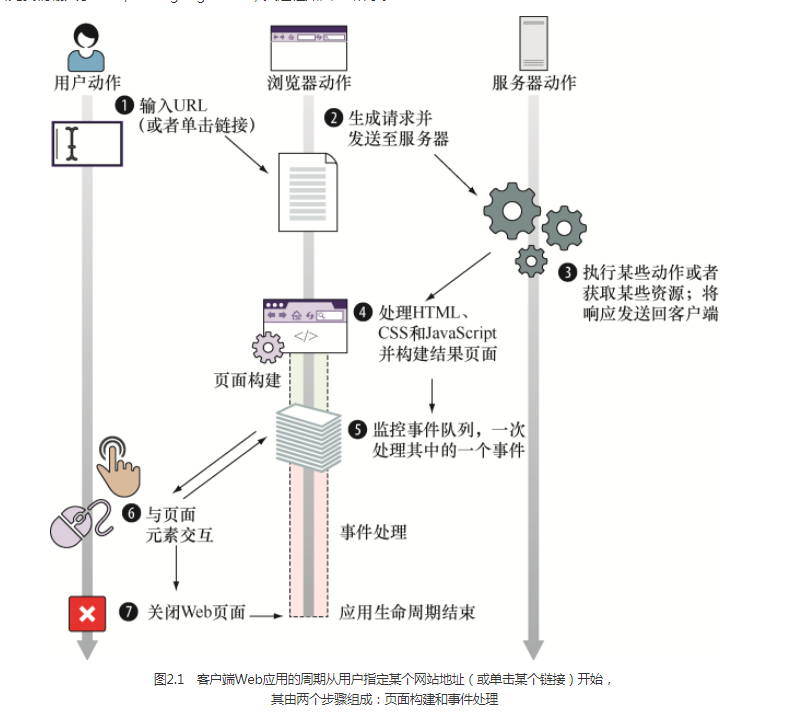
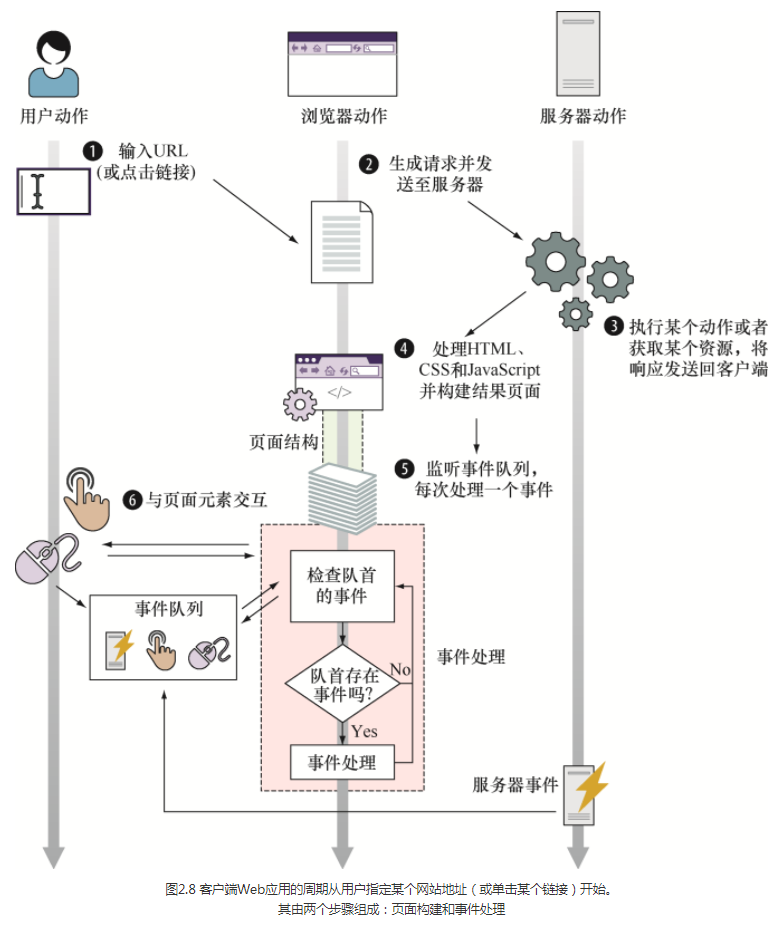
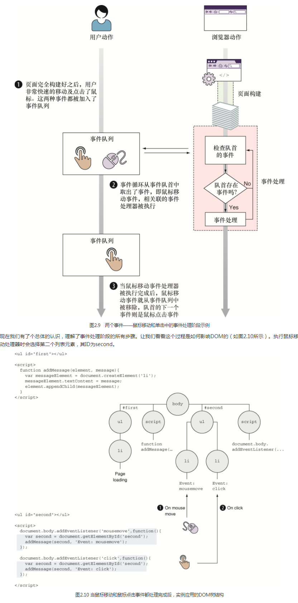
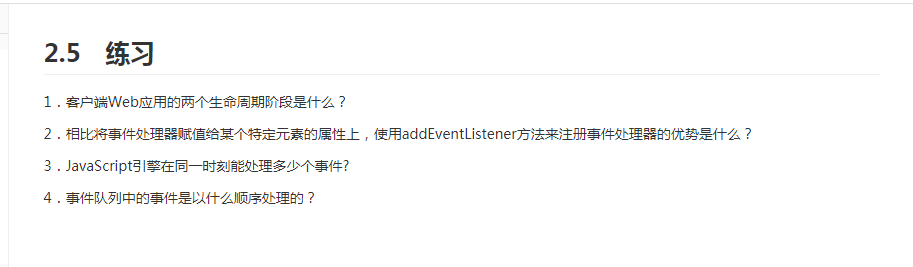
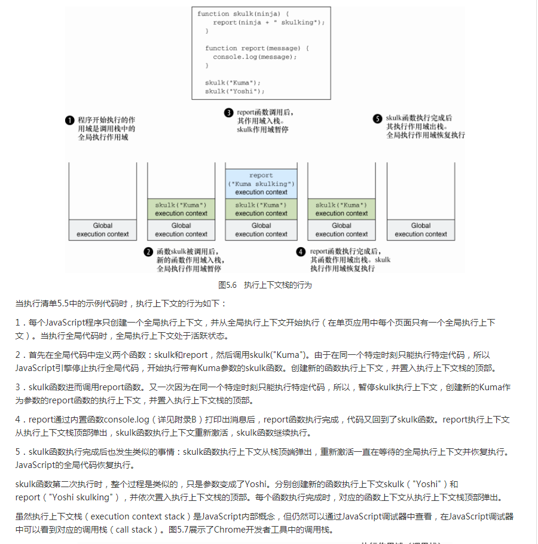
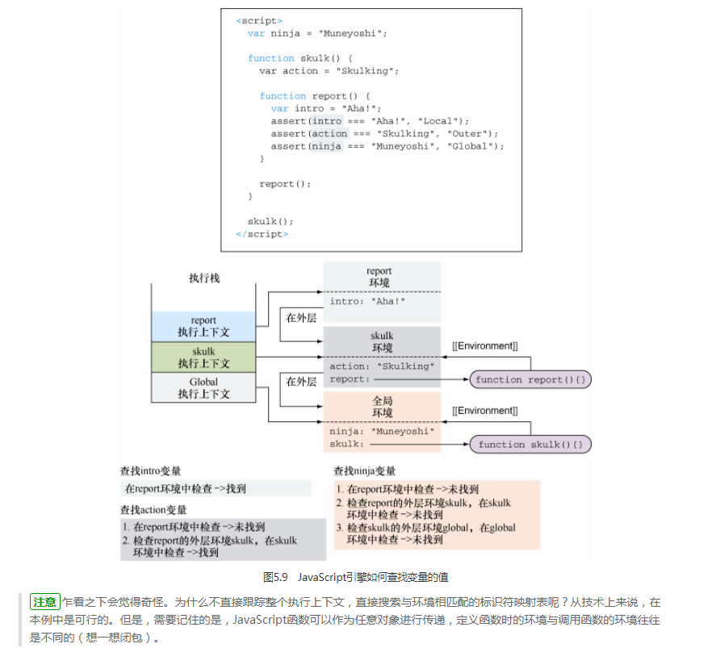
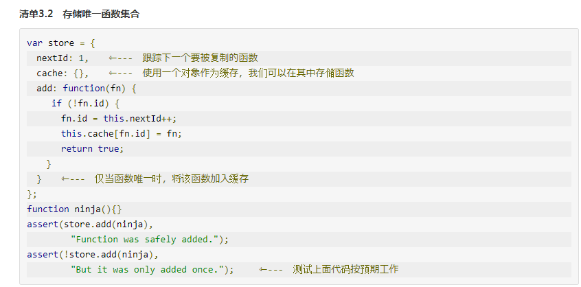
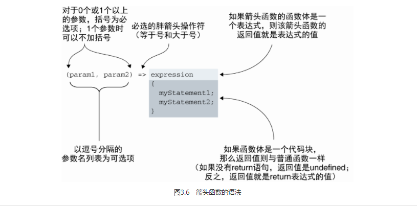
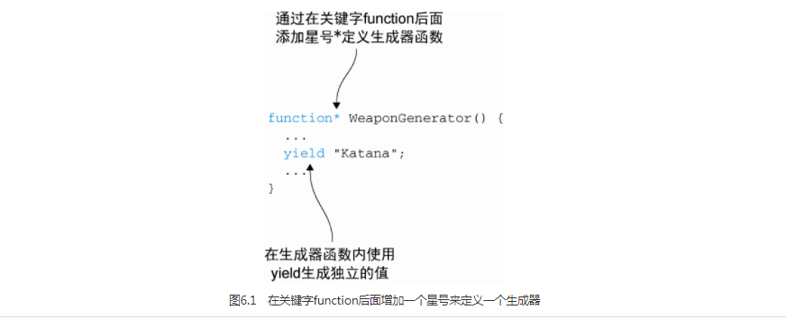

# 发现一本好书想要推荐给你
接触这本书的第一版，是外刊君的神秘礼物。收到神秘礼物之后迫不及待的读完，在读的过程中一直感叹是一本好书，感谢外刊君带我在知识的海洋里面遨游了一番。针对第一版我做了一些笔记有兴趣可以看看[原型与面向对象](https://github.com/sunseekers/Article-CSS-HTML-JavaScript/blob/master/prototype.md) 和 [函数](https://github.com/sunseekers/Article-CSS-HTML-JavaScript/blob/master/Function.md)这里面添加了一些我自己的想法和理解；哈哈！

前段时间这本书出了第二版，这一次是我 `leader` 推荐了，当时他问我看了《JavaScript 忍着秘籍》第二版没有？那时候我才知道出了第二版。我 `leader` 说第二版添加了好些 `ES6` 语法。既然我的 `leader` 都推荐了，之前又有外刊君的推荐，再加上我自己读了第一版的的感觉也很不错。迫不及待的读了第二版，在读的过程中我不断发出感慨真是本好书，作者写的太好了，而且和我写文章风格一样，好感度爆棚哈哈哈！

简单介绍第一版和第二版的差别吧！第一版主要是 `js` 深程度的剖析，可以提升 `js` 水平，你看看我前面做的笔记就知道了，第二版在第一版的基础之上加了 `ES6` 的语法，穿插第一版的内容。有深有浅图文并茂特别好。适合基础，想要进一步提升 `js` 水平的朋友看，不适合作为入门。文章所有截图，内容均来自书籍内容。我负责搬运，你负责学习。如果有朝一日你混好了，记得能带我混前端。哈哈哈哈

## 推荐理由一
第一部分热身活动中介绍 `Web` 应用的生命周期从开始到结束，讲的特别好，一张图片展示整个生命周期在配有相对应的文字解释。图文并茂，这是我目前见过为数不多的一张好图了；作为前端入门，而去了解整个生命周期挺好的

作为一个写代码的，我们当然更加关注浏览器是如何构建页面的啦！前端不就是负责构建页面的嘛

我们负责页面构建，浏览器负责页面渲染，两者分工明确，相互合作，相互照顾。 `HTML`解析和 `DOM` 构建

我们追求用户体验最佳，为了满足用户的各种需求，我们假想用户可能会干些什么，用事件来处理

假想此刻用户的某些操作

这书的作者考虑到了我们可能会受到应试教育的影响，如此体贴用心的作者，有始有终。章节头有概括，章节未有小结。内附压轴答题

不知你曾经是否遇到过面试官问这些问题？如果没有，那么我的推荐理由二肯定就有了哈哈
## 推荐理由二
第二部分介绍函数 ，和第一版相差不大，但是比第一版更加详细
函数存储唯一集合，注释配上代码，一目了然。本书一直在强调不适合初学者，需要有一定的基础，是进阶学习。可是我觉得他对初学者也很好呀！

[原型与面向对象](https://github.com/sunseekers/Article-CSS-HTML-JavaScript/blob/master/prototype.md) 和 [函数](https://github.com/sunseekers/Article-CSS-HTML-JavaScript/blob/master/Function.md) 曾经介绍过，这里不累赘。有兴趣自己戳链接，另附两张图看看函数
函数的执行

函数查找变量

存储唯一的函数

重点看看 `ES6` 的语法吧！如今 `ES`系列已经更新了好几个版本了，绝大部分的浏览器都已经支持 `ES6` 了，我们在用过去的 `ES5` 似乎会被时代所抛弃。我们就大胆的用 `ES6` 吧。反正我用着是挺习惯的。我喜欢它友好简洁，代码量少

叨叨念念的箭头函数

比较陌生的生成器

生成器和迭代对象相亲相爱

 
Map是啥

模拟 `Set` 的实现

`Node.js` 很喜欢 `ES6` 的生成器、 `Promise` 之列的应该不陌生。因为未来会经常用到的

## 推荐理由三

上手学习就是最好的推荐

