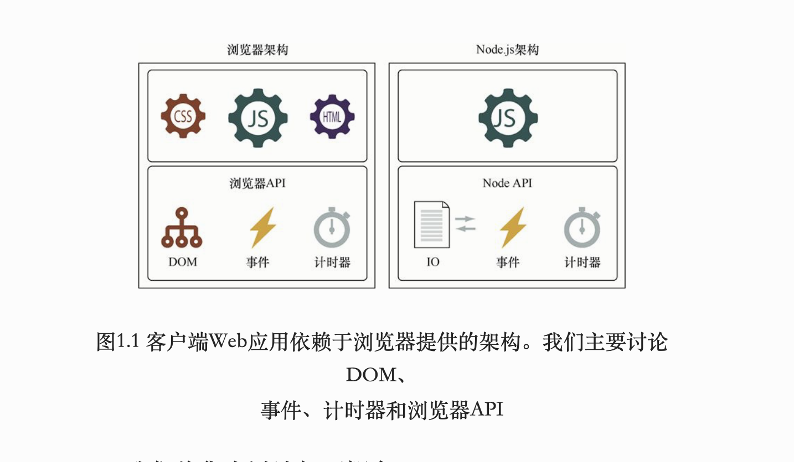
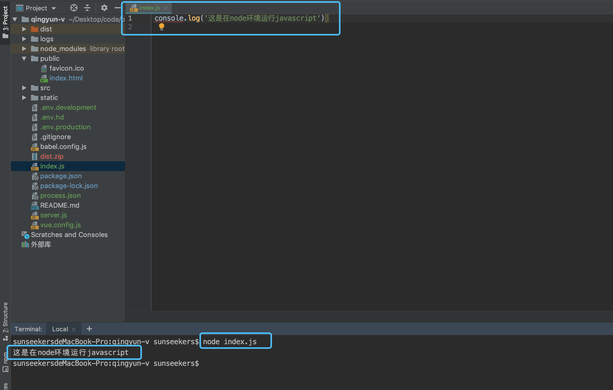
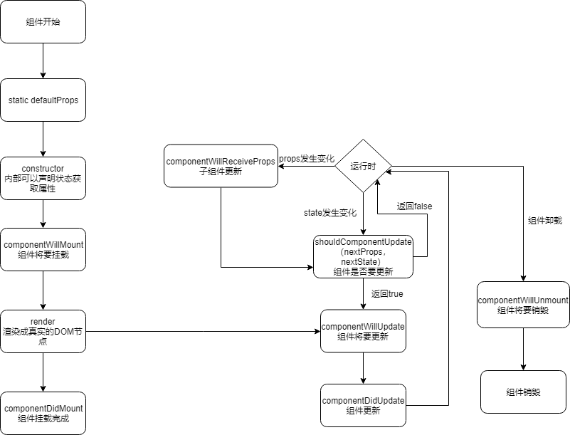
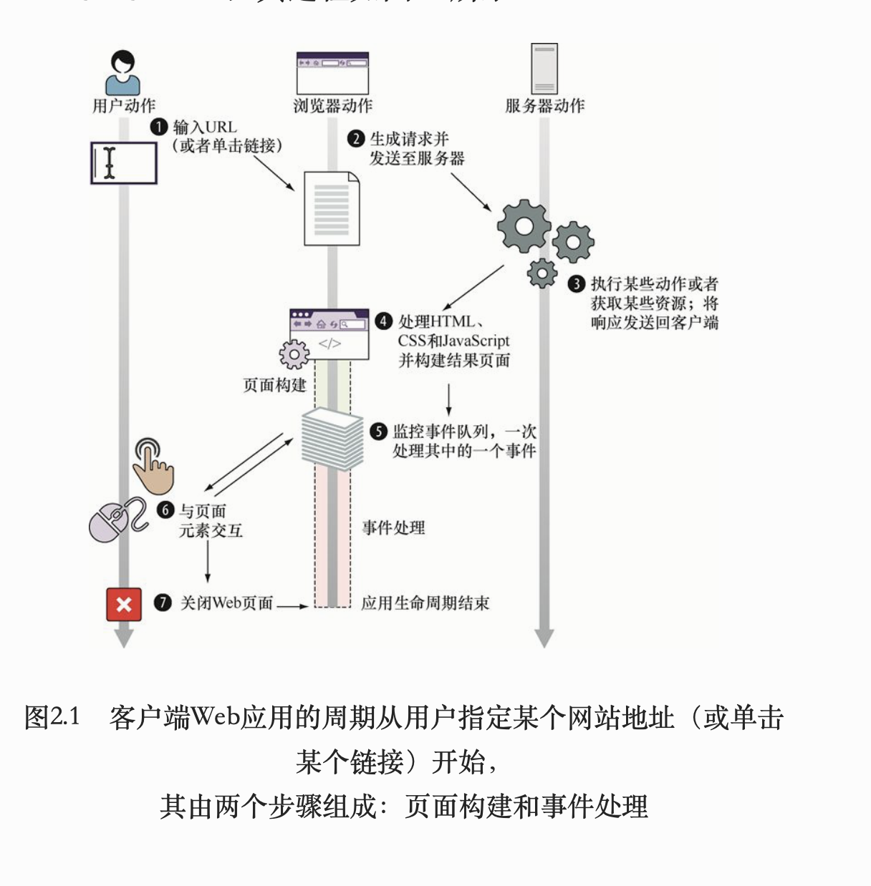
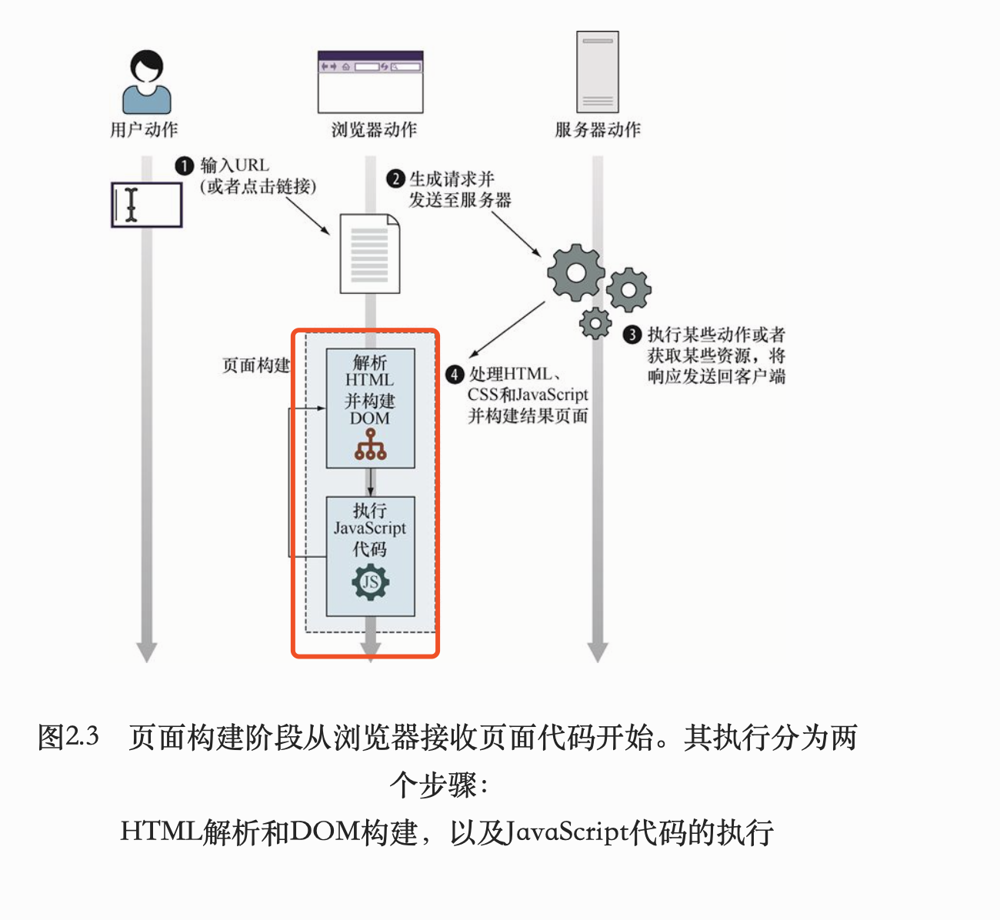
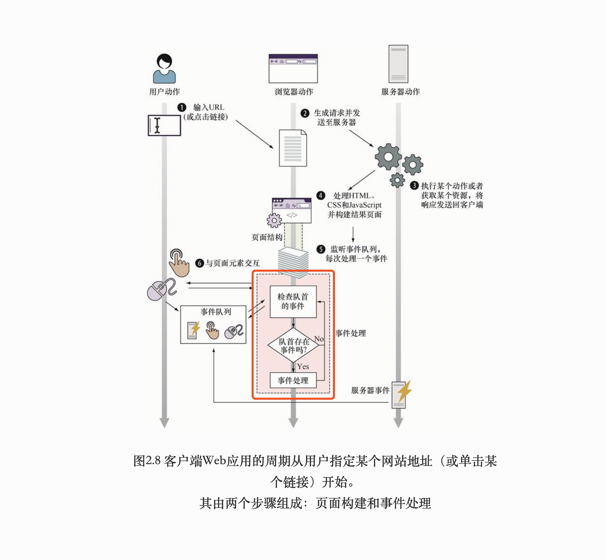

那些我所不知道的 `JavaScript ` （一）

我要推荐一本书，《javascript 忍者秘籍2》，每次阅读都有不一样的收获。这次推荐，我想对于每一个章节里我不懂的地方，或者说我认为重要的地方说一说。

关于这些知识点网上百度搜一大堆，比我写的好的多了去了，但是我还是要写，别人写的终究是别人的，我自己写了，是对知识的二次记忆，记住了才是我的。

首先声明，文章里面所有的图片内容都来自书籍中。内容有书中和我自己的理解。一千个读者就有一千个哈利波特。我建议你去读读这本书，如果有不对的地方请指出


`JavaScript` 能在很多环境中执行。但是 `JavaScript` 最初的运行环境是浏览器环境，而其他运行环境也是借鉴于浏览器环境。



举个在`node`环境运行的例子：



浏览器环境太常见了，不举例子的，其他的我不熟不说了，欢迎评论评论补充
 

要学好前端，我们需要了解`javaScript` 工作核心原理和浏览器提供的核心 `api` 

我们所接触的大部分东西都有他的生命周期，比我们前端三大框架中 `vue` 和 `react`




还一个我没有接触过，就不说了（ps：逃

有始有终，都有一个从开始到结束的过程。我们的浏览器渲染前端页面也是一样的，只是我们平时忽略他罢了。当我们在浏览器地址栏里面输入一串 `url` 开始他的生命周期就已经开始了，当我们关闭网页的时候他的生命周期就结束了。如图所示


作为前端的我所关注的是页面的构建和事件的处理

页面构建又可以分为解析 `HTML` 代码并且构建文档对象模型 `DOM` 和执行 `JavaScript` 代码

注意了 `DOM` 是根据 `HTML` 代码来创建的，但是两者并不是相同的。我们可以把 `HTML` 代码看作浏览器页面 `UI` 构建初始 `DOM` 的蓝图。为了正确构建每个 `DOM`，浏览器还会修复它在蓝图中发现的问题。比如在 `p` 元素里面包裹 `div` 元素，最终渲染的并不是父子关系，而是兄弟关系。

当解析到脚本元素时，浏览器就会停止从 `HTML` 构建 `DOM`，并开始执行 `JavaScript` 代码。为了避免解析 `JavaScript` 代码花费太长时间，而阻塞页面渲染。我们都是建议把`JavaScript` 代码放到 `body` 元素后面，就是在构建完了`DOM`之后。（解析`javascript` 会阻塞页面渲染）

浏览器暴露给 `JavaScript` 引擎的主要全局对象是 `window` 对象，它代表了包含着一个页面的窗口。 `window` 对象是获取所有其他全局对象、全局变量（甚至包含用户定义对象）和浏览器 `API` 的访问途径。全局 `window` 对象最重要的属性是 `document`，它代表了当前页面的 `DOM`。（在控制台输入`window` 可以查看全局属性和方法）

包含在函数内的代码叫作函数代码，而在所有函数以外的代码叫作全局代码。

执行上下文也分两种 全局执行上下文和函数执行上下文；当 `JavaScript` 程序开始执行时就已经创建了全局上下文；而函数执行上下文是在每次调用函数时，就会创建一个函数上下文
                         
页面构建完了之后变进入第二个阶段，事件处理

浏览器执行环境的核心思想基于：同一时刻只能执行一个代码片段，即所谓的单线程执行模型。采用事件队列来跟踪发生但是尚未执行的事件（`JavaScript` 是单线程，可能是为了防止两段代码同时修改一个`DOM`,造成页面混乱，什么的）
一个任务一旦被执行，就不会被其他任务给中断

 
                       
 [转移到函数相关](https://github.com/sunseekers/Article/blob/master/Function.md)

 [转移到原型相关](https://github.com/sunseekers/Article/blob/master/prototype.md)


`Number`、`String` 和 `Boolean`，三个构造器是两用的，当跟 `new` 搭配时，它们产生对象，当直接调用时，它们表示强制类型转换。

`promise`  模拟一个请求， `axios` 实现原理，应该就是用他，我并没有阅读过源码我猜测的。

```
function getJSON(url){
    return new Promise((resolve,reject)=>{//创建并返回一个新的promise对象
        const request = new XMLHttpRequest()//创建一个XMLHttprequest对象
        request.open('GET',url)//初始化请求
        request.onload=function(){//“注册一个onload方法，当服务端的响应后会被调用”
                try{
                if(this.status==200){//“即使服务端正常响应也并不意味着一切如期发生，只有当服务端返回的状态码为200（一切正常）时，再使用服务端的返回结果”
                  resolve(JSON.parse(this.request))//“尝试解析JSON字符串，倘若解析成功则执行resolve,并将解析后的对象作为参数传入”
                }else{
                    reject(this.status+' '+ this.statusText)
                }
            }catch(e){
                reject(e.message)//“如果服务器返回了不同的状态码，或者如果在解析JSON字符串时发生了异常，则对该promise执行reject方法”
                }
        }
        request.onerror=function(){//“如果和服务器端通信过程中发生了错误，则对该promise执行reject方法”
          reject(this.status+' '+ this.statusText)
        }
        request.send()//发送请求
    })
}
getJSON("data/ninjas.json").then(ninjas => {

}).catch(e => fail("Shouldn't be here:" + e)); 　　//←---　使用由getJSON函数创建的promise来注册resolve和reject回调函数”

```                               
   
                                                 

