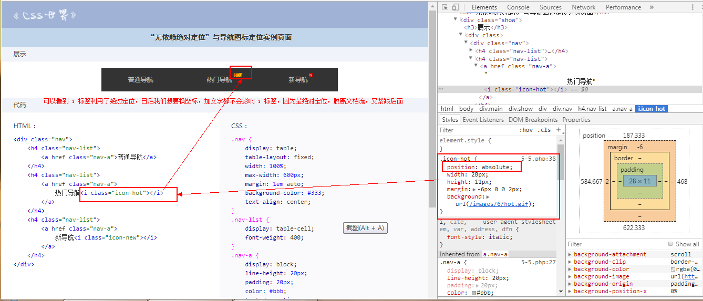
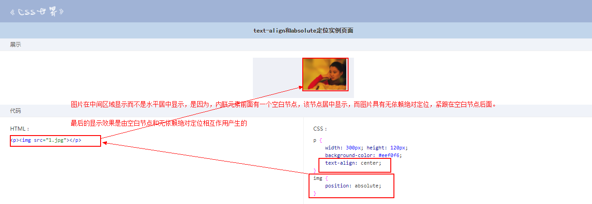
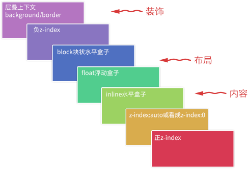
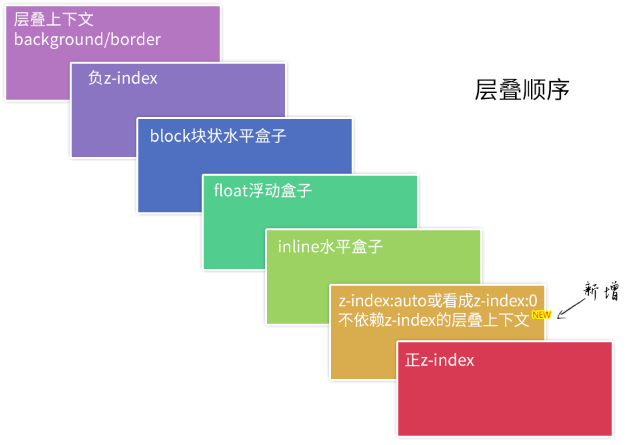

# `position`
## `position: absolute`
`position: absolute` 具有块级化，包裹性，破坏性等

> 当 `absolute` 和 `float` 同时存在的时候，`float` 属性无任何效果

> 元素一旦 `position` 属性值为 `absolute` 或者 `fixed` ,他的 `display` 计算值就是 `block`

> `z-index` 属性和 `position` 属性不为 `static` 的元素在一起才起作用
### 具有相对定位的无依赖 `absolute` 绝对定位
当一个绝对定位元素没有任何 `left/top/right/bottom` 属性设置，并且其全部祖先元素都是非定位元素，**他的位置就还是再当前位置**，不是在浏览器左上方；脱离了文档流；
```
HTML：


CSS：
.top1 {
  position: absolute;
}
```
[查看案例](http://demo.cssworld.cn/6/5-4.php)

**`absolute` 是非常独立的 `CSS` 属性值，其样式和行为表现不依赖其他任何 `CSS` 属性就可以完成**

我们把这种特性称为 "无依赖绝对定位" ,比使用 `left/top` 属性定位实用和强大多了，不仅代码简洁多了，还具有一个新的特性 “相对定位特性” (相对定位是相对于原来的位置没有变化，只是不占据 `CSS` 流的尺寸空间，日后维护成本低，容错性更强)



[查看案例](http://demo.cssworld.cn/6/5-5.php)


[查看案例](http://demo.cssworld.cn/6/5-6.php)

利用的都是 `absolute` 的 "无依赖绝对定位" ，不占据 `CSS` 的尺寸空间，脱离了文档流
### `text-align` 可以改变 `absolute` 元素的位置

```
HTML：
<p></p>

CSS：
p {
    width: 300px; height: 120px;
    background-color: #eef0f6;
    text-align: center;
}
img {
    position: absolute;
}
```


适合使用场景：主窗体右侧的“返回顶部”，“反馈” 等小布局

[查看案例](http://demo.cssworld.cn/6/5-10.php)

###  `absolute` 属性值
只有在 `absolute` 遇到了 `left/top/right/bottom` 属性时，才会变成真正的绝对定位元素；

`absolute` 的**流体特性**：当对立方向同时发生定位的时候，就会具有流动性，大小适应该包含块的 `padding box` ；**绝对定位元素可以让垂直水平方向都同时保持流动性**

## `position: relative`
> 可以让元素依然保持在正常的文档流中；

> 相对自身定位，无侵入

> 相对定位元素的 `left/top/right/bottom` 的百分比是相对于包含块计算的(`padding box`) 

> `left/top/right/bottom`四个属性值同时存在时，遵循从上到下，从左到右；所以 `right/bottom` 视为无效

### 尽量不要使用 `relative` 或者  `relative` 能够影响的范围最小

因为一旦普通元素变成相对定位元素，该元素的层叠顺序就提高了




## `position: fixed`
`position：fixed` 是相对于根元素的，也只有根元素才会限制他