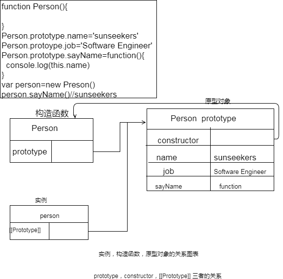
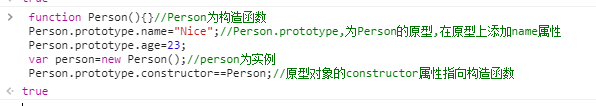
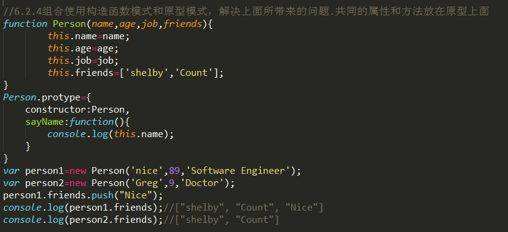
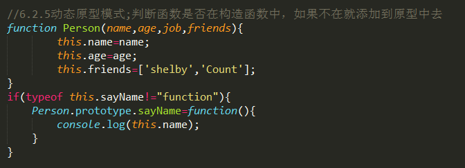

# 原型与面向对象

对象：属性值的集合(属性值可以是简单的值（字符串，数值），也可以是函数或者其他对象)，属性可以包括基本值，对象，或者函数

Object创建的方法：
>* 1.对象字面量
```python
var person={
    name: "Nice,
    age: 23
}
```
优点：代码量少，给人封装数据的感觉，也可以向函数传递大量可选参数；在实际开发中常用

>* 2.new 操作符后跟Object构造函数
```python
var person=new Object();
person.name="Nice;
person.age=23；
```
>* 3.工厂模式
```python
function createPerson(name,age){
    var o=new Object();
    o.name=name;
    o.age=age;
    return o;
}
var person=createPerson("Nice",23);
```
用一个函数把构造函数包裹起来，再在该函数体内返回改该构造函数

>* 4.构造函数模式
```python
function Person(name,age){
    this.name=name;
    this.age=age；
    this.sayName=function(){
        this.name;
    }
}
var person=new Person("Nice",23);
```
构造函数始终都应该以一个大写字母开头，构造函数它本身就是一个函数，如果没有 `new` 关键字，他就和普通的函数调用一模一样；
调用构造函数经历四个步骤：
> 1.创建一个新对象

> 2.将构造函数的作用域赋给新对象（this就职向这个新对象）

> 3.执行构造函数中的代码

> 4.返回新的对象

构造函数创建对象的问题：每个方法都要在每个实例上都要重新创建创建一遍,不同的实例的同名函数是不相等；因此创建了大量的重复代码；（实例，构造函数，原型对象之间的关系请看下面）

解决方法：原型模式

原型：每一个对象都含有原型的引用，当查找属性的时候，若对象本身不具有该属性，则会查找原型上是否具有该属性

原型链：每一个对象都具有一个原型，每一个对象的原型也有一个原型，以此类推，形成一个原型链

原型所定义的属性和功能会自动应用到对象的实例上

所有函数在初始化的时候都有一个 `prototype` 属性，该属性的初始值是一个空对象，只有函数在作为构造函数的时候，`prototype` 属性指向原型对象，这个对象包含所有实例共享的属性和方法

所有原型对象会自动获取一个 `constructor` 属性，指向构造函数



**由此可以看出，实例和构造函数之间没有什么直接的关系**



```
function Person(){}
Person.prototype.dance=function(){}
function Ninja(){}
Ninja.prototype={dance:Person.prototype.dance}
```

 注意：Person.prototype设置为一个对象字面量形式创建的新对象时，就切断了原来对象的联系（即constructor属性不在指向Person）


如果constructor的值很重要可以向在新对象中设置：


造成这个原因是，**实例和原型之间的松散链接关系**，实例中的指针只指向原型，而不指向构造函数（可以看上面，原型，实例，构造函数直接的关系）

对象和函数原型之间的关系是在对象创建的时候建立的

```
function Nija(){
 return this.swuing = true
}
const nija = new Nija()
Nija.prototype.swuingSword = function(){
return this.swuing
}
Nija.prototype = {
 price(){
    return false
 }
}
const nija1 = new Nija()
```
nija1 和 nija 拥有不一样的方法，因为对象和函数原型之间的关系是在对象创建的时候建立的，新创建的对象将引用着新的原型，原来旧的对象保持着原有的原型

但是重设 `constructor` 属性，会导致它的`[[Enumerable]]` 的特性被设为 `true`,最好使用 `Object.defineProperty()`

`Object.defineProperty()`: 这个方法接受三个参数，属性所在的对象，属性的名字，一个描述符对象；其中描述符对象的属性的一个或者多个值(`Configurable`,`Enumerable`,`Writable`,`Value`，`get`,`set`)，一旦`configurable` 定义为不可配置的(`false`)，就不能把它修改成可配置的，返回被传递的对象

`Object.defineProperties()`:一次性可修改多个属性，第一个参数是属性对象，第二个参数是所要修改的数据属性组成的集合（即要修改的数据对象），返回被传递的对象

`Object.getOwnPropertyDescriptor()`:读取属性描述符；第一个参数是属性所在的对象，第二个是要读取其描述符的属性名称，返回一个对象

构造函数内部的绑定操作符优先级永远都高于在原型上绑定的操作符优先级，在应用对象的一个属性时，优先检查该对象上本身是否拥有该属性，如果有则直接返回，否则继续在原型上面找，找不到就返回 `undefined`。一般情况不会轻易去修改原型对象上的属性，一旦修改就会出现各种问题；

## 判断属性是实例还是原型的几种常用方法
`hasOwnProperty()`:如果返回 `true`,该属性存在实例当中
```
person.hasOwnProperty('name')；//返回 true，name 属性在 person 实例当中
```

`in` 操作符，只要返回 `true`，该属性就在对象中，也许是原型中，也许是实例当中
```
'name' in person //返回 true ，该属性存在
```
`for-in`循环时，返回所有能够通过对象访问的，可枚举的属性

`Object.keys()`:返回对象上所有可枚举的**实例属性**组成的字符串数组
```
function Person(name,age){
    this.name=name;
    this.age=age;
    this.sayName=function(){
        this.name;
    }
}
Person.prototype.job=function(){

}
var person=new Person();
console.log(Object.keys(person));//返回["name", "age", "sayName"]
```
## 原型对象的问题
函数的原型是一个对象，所以有很多功能(属性或者方法)可以通过赋值的方法到达继承的目的，同时也可以定义新的方法；

因为原型对象上所有的属性和方法是共享的，而对于属于引用类型值的属性来说，会直接修改原型对象上的属性，造成 `bug`,引一发而动全身

## 解决原型对象的问题

> 1. 构造函数和原型模式相结合：引用类型值的属性放在构造函数当中，其他共享的不会修改属性放在原型对象上



> 2.动态原型模式：根据函数是否在构造函数中，而选择性的添加到原型对象中去



> 3.寄生构造函数

长得和工厂模式一模一样，不同的是，通过 `new` 操作符来调用
```
function Person(name,age){
    var o=new Object();
    o.name=name;
    o.age=age;
    return o;
}
var friend=new Person();
```

继承是代码复用的一种方式，是将一个对象的属性扩展到另一个对象上。

