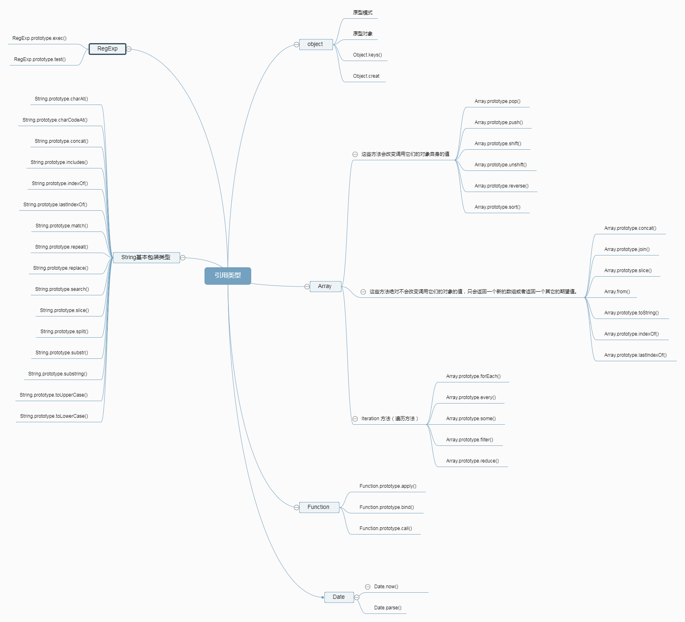

JavaScript有七种内置类型：空值（`null`），未定义（`undefined`），数字（`number`），字符串（`string`），布尔值（`boolean`），对象（`object`），符号（`symbol`，`es6`中新增）

注意：除了对象之外其他的统称”基本类型”

<span style='color:rgb(230,3,135);'>引用类型</span>

 

> 引用类型的值（对象）是引用类型的一个实例；在ECMAScript中，引用类型是一种数据结构，用于将数据和功能组织在一起；

<i>对象是某个特定引用类型的实例</i>

基本类型值：简单的数据段；复制变量是复制变量的值；占据固定大小的空间，保存在栈内存中；

引用类型值：由多个值构成的对象，复制对象是对象的地址（指针）；保存在堆内存中；函数是对象的一个子集

所有函数的参数都是按值传递的，参数是函数的局部变量；形参和实参最好不要一样，以免混淆；

```
function setName(obj){
    obj.name='Nicholas';
    //这里 obj 指向了新对象所在的地址，切断了和原的联系
    obj=new Object();
    obj.name='sunseekers';
}
var person=new Object();
setName(person);//obj 和 person 指向内存中的同一块地址
console.log(person.name);//最后结果说明，函数的参数是按值传递的
```

> 检测类型：

>* 

>* instanceof操作符检测引用类型和基本类型；基本类型返回false；

执行环境：变量或者函数有权访问的其他数据，决定了她们各自的行为，每个执行环境都有一个变量对象；代码在环境中执行的时候会创建变量对象的一个作用域链；(作用域存在的那一段空间)；

访问局部变量比全局变量块；

我们接触使用最多的引用类型值都是Object类型的实例

## `<script>` 元素的属性

> `async`：可选,表示应该立即下载脚本，但不应妨碍页面中其他的操作，比如下载其他的资源或者等待载在其他脚本，只对外部脚本文件有效.有时候也成异步脚本；
```
<script  async src=”example1.js”></script>
<script  async src=”example2.js”></script>
```
在以上代码中，第二个脚本文件可能会在第一个脚本文件之前执行，因此确保两者之间互不依赖非常重要。指定 `async` 属性的目的是不让页面等待两个脚本下载和执行，从而异步加载页面其他内容
> `defer` ：可选，表示脚本可以延迟到文档完全被解析和显示之后在执行。只对外部脚本文件有效。这个属性的用途是表明脚本在执行时不会影响页面的构造，也就是说，脚本会被延迟到整个页面都解析完毕之后在运行，在 `script` 元素中设置 `defer` 属性，相当于告诉浏览器立即下载，但延迟执行。
```
<script   defer=”defer” src=” example1.js”></script>
```
> `src`：可选，表示是否要引入外部文件，我们习惯的引入外部文件，相对于嵌入代码而言，外部文件可维护性，可缓存，适应未来

现代 `web` 应用程序一般都把全部的 `JavaScript` 引用放在 `body` 元素中页面的内容后面。目的缩短页面加载时间，打开页面的速度也加快了；

所有 `<script>` 元素都会按照它们在页面中出现的先后顺序一次被解析，在不使用 `defer` 和 `async` 属性的情况下，只有在解析完前面 `<script>` 元素中的代码之后，才会开始解析 `<script>` 元素中的代码
 ## 基本概念
> 表示符: 变量，函数，属性的名字，或者函数的参数

> 变量： `var` 操作符声明的（省略var操作符可以定义全局变量，但是这也不是我们推荐的做法，因为会在局部作用域中定义的全局变量很难维护，而且如果有意的忽略 `var` 操作符，也会由于相应变量不会马上就有定义而导致不必要的混乱，给未经声明的变量赋值在严格模式下会导致抛出 `ReferenceError` 错误）

> `typeof`: 确定一个变量是基本类型中的哪一种（除了 `null` 返回 `object`,其他的都和同名的字符串值与之相对应）

> `boolean`: 五种情况下转化为 `false` 的值，空字符串 ,  0 , `NAN` , `null` `undefined`

### 代码规范
>* 为选择器分组时，将单独的选择器单独放一行
为了代码的易读性，在每个声明块的左花括号前添加一个空格

>* 声明块的右花括号应当单独成一行

>* 每条声明语句的后应该插入一个空格；

>* 为了获得更准确的错误报告，每条声明都应该独占一行；

>* 所有声明语句都应该以分号结尾，最后一条语句后面的分号是可选的，但是如果省略这个分号结尾，你的代码可能更易出错；

>* 对于以逗号分隔的属性值，每个逗号后面都应该插入一个空格；

>* 不要在 `rgb()`、`rgba()`、`hsl()`、`hsla()` 或 `rect()`值得内部的逗号后面插入空格，这样有利于从多个属性值（既加逗号也加空格）中区分多个颜色值（只加逗号，不加空格）

>* 对于属性值或颜色参数，省略小于 1 的小数前面的 0（例如 .5 代替 0.5 ; -.5px 代替 -0.5）；

>* 尽量使用简写的十六进制，例如用 `#fff` 代替`#ffffff` ；小写字符易于分辨，因为他们的形式更加于区分

>* 为选择器中的属性添加双引号 `input[type="text"]`。只有在某些情况下是可选的，但是，为了代码的一致性，建议都加上双引号。

>* 避免为 0 值指定单位，例如用 `margin ：0 `代替`margin：0px`

### 属性顺序
>* `HTML` 属性应当按照以下给出的顺序依次排序，确保代码的易读性 `class`, `ID`, `name` ,`Data`
`src` , `for` , `type`  , `href`  , `value`
`title` , `alt`;
`class` 用于标识高度可复用组件，因此应该排在首位。`id` 用于标识具体组件，应当谨慎使用（例如，页面内的书签），因此排在第二位。

>* 编写 `HTML` 代码时，尽量避免多余的父元素。很多时候，这需要迭代和重构来实现。

### 声明顺序
>* 相关的属性声明应当归为一组,定位（ `positioning`）可以从正常的文档流中移除元素，并且还能覆盖盒模型（`box model`）相关的样式，因此排在首位。盒模型排在第二位，因为它决定了组件的尺寸和位置。

>* 带前缀的属性,当使用特定厂商的带有前缀的属性时，通过缩进的方式，让每个属性的值在垂直方向对齐，这样便于多行编辑。

>* 单行规则声明,对于只包含一条声明的样式，为了易读性和便于快速编辑，建议将语句放在同一行。对于带有多条声明的样式，还是应当将声明分为多行。这样做的关键因素是为了错误检测 

>* 简写形式属性声明,在需要显示地设置所有值的情况下，应当尽量限制使用简写形式的属性声明。

>* 注释代码是由人编写并维护的。请确保你的代码能够自描述、注释良好并且易于他人理解。好的代码注释能够传达上下文关系和代码目的。不要简单地重申组件或 `class` 名称。

### `css` 优化原则：
>* 尽量减少 `HTTP` 请求个数

>* `css sprites`:合并多个背景图像到一个简单图像，然后通过 `background-image` 和`background-position` 进行调整
`image maps`,结合多个图像到一个单独图像，其总体体现规模大致是相当的，但是减少 `HTTP` 请求数量，从而加快页面显示速度；

>* 页面顶部引入 `css`，可以提高页面加载速度，样式表放在头部，允许页面逐步呈现

>* 将 `css` 和 `js` 放到外部文件中，页面引入外部文件，将由浏览器缓存，后续页会使用缓存

>* 合并样式，提前定义统一的样式，利用 `css` 继承，

>* 缩小样式文件，尽量使用简写属性，

>* 选择更优的样式属性值，减少样式重写

>* 使用代码工具压缩 `css` 代码，不要在 `HTML` 中缩放图像，避免空的 `src` 和 `href`